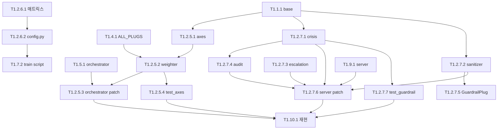

# DEVPLAN-TASKS v2.1 패치 (axes + MENTAL_CORE + 가드레일)

**선행**: `MCP-THERAPY-DEVPLAN-TASKS.md` v2.0
**근거**: `MCP-THERAPY-WHITEPAPER-v0.3.md`
**작성**: 2026-04-24 Claude Opus 4.7
**변경**: 신규 TASK 13개 추가 (axes 4 + MENTAL_CORE 2 + 가드레일 7)

---

## 변경 요약

| Sprint | 신규 TASK 수 | 담당 Lane | 예상 시간 |
|--------|------------|----------|----------|
| 1.2.5 Axes (5축 ISA) | 4 | B/C/A | 90분 |
| 1.2.6 MENTAL_CORE | 2 | A | 40분 |
| 1.2.7 Guardrail | 7 | A/C | 150분 |
| **합계** | **13** | — | **~280분 (병렬 가능)** |

---

## Sprint 1.2.5 — 도메인 ISA (5축) 🆕

### TASK T1.2.5.1
```yaml
TASK: T1.2.5.1
title: mcp/core/axes.py — 5축 추상 클래스 + 구현 5종
agent_primary: sonnet
agent_fallback: opus
lane: B
depends_on: [T1.1.1]
blocks: [T1.2.5.2, T1.2.5.3]
estimated_min: 30
risk_level: low

briefing: |
  백서 v0.3 §5. 박씨 2026-04-24 로그의 F(꿈) = Grief ∘ Guilt ∘ Eros ∘ Rage
  합성 함수를 5축(+ Liberation)으로 확장. 플러그 위에 올라가는 분석 좌표계.

instruction: |
  1. 파일 생성: mcp/core/__init__.py (빈 파일)
  2. 파일 생성: mcp/core/axes.py
  3. 코드:
     ```python
     from abc import ABC, abstractmethod

     class Axis(ABC):
         id: str
         name_ko: str
         keywords: list[str]
         metaphors: list[str]

         @abstractmethod
         def extract(self, narrative: str, metadata: dict) -> float: ...

     class GriefAxis(Axis):
         id = "grief"
         name_ko = "애도"
         keywords = ["죽음", "상실", "떠났", "보냈", "끝", "마지막", "작별"]
         metaphors = ["장례", "무덤", "겨울", "저물", "사라"]

         def extract(self, narrative, metadata):
             direct = sum(1 for k in self.keywords if k in narrative) * 0.12
             indirect = sum(1 for m in self.metaphors if m in narrative) * 0.06
             if metadata.get("is_dream") and "죽" in narrative:
                 direct += 0.3
             return min(direct + indirect, 1.0)

     class GuiltAxis(Axis):
         id = "guilt"
         name_ko = "죄책감"
         keywords = ["미안", "죄책", "잘못", "책임", "빚", "부채", "병신"]
         metaphors = ["그림자", "짐", "빚"]

         def extract(self, narrative, metadata):
             direct = sum(1 for k in self.keywords if k in narrative) * 0.15
             return min(direct, 1.0)

     class ErosAxis(Axis):
         id = "eros"
         name_ko = "삶의 욕구"
         keywords = ["외롭", "그립", "사랑", "살고 싶", "접촉", "누군가",
                     "관계", "업소", "성"]
         metaphors = ["봄", "꽃", "빛"]

         def extract(self, narrative, metadata):
             direct = sum(1 for k in self.keywords if k in narrative) * 0.12
             return min(direct, 1.0)

     class RageAxis(Axis):
         id = "rage"
         name_ko = "분노"
         keywords = ["짜증", "분노", "욕", "씨발", "병신", "꺼져",
                     "지긋지긋", "불공평", "억울"]

         def extract(self, narrative, metadata):
             direct = sum(1 for k in self.keywords if k in narrative) * 0.15
             return min(direct, 1.0)

     class LiberationAxis(Axis):
         id = "liberation"
         name_ko = "해방"
         keywords = ["편하", "가볍", "자유", "해방", "놓", "벗어", "시원",
                     "맑", "트인", "열린"]
         metaphors = ["아침", "창문", "새소리", "햇빛"]

         def extract(self, narrative, metadata):
             direct = sum(1 for k in self.keywords if k in narrative) * 0.12
             indirect = sum(1 for m in self.metaphors if m in narrative) * 0.08
             return min(direct + indirect, 1.0)

     ALL_AXES = [GriefAxis(), GuiltAxis(), ErosAxis(), RageAxis(), LiberationAxis()]
     ```

verify: |
  python3 -c "
  from mcp.core.axes import ALL_AXES, GriefAxis, LiberationAxis
  assert len(ALL_AXES) == 5
  # 박씨 로그 검증
  g = GriefAxis().extract('어머니가 돌아가시는 꿈', {'is_dream': True})
  assert g > 0.3
  l = LiberationAxis().extract('오랜만에 잘 잤다 창문 열고 햇빛 새소리', {})
  assert l > 0.2
  print('axes OK')
  "

outputs:
  - mcp/core/__init__.py
  - mcp/core/axes.py

commit_message: "feat: 도메인 ISA 5축 구현 (T1.2.5.1)"
```

### TASK T1.2.5.2
```yaml
TASK: T1.2.5.2
title: mcp/core/axes_weighter.py — plug × axis 매트릭스
agent_primary: sonnet
lane: B
depends_on: [T1.2.5.1, T1.4.1]
blocks: [T1.5.1_patch]
estimated_min: 25

briefing: |
  백서 v0.3 §5.3 + 부록 C 매트릭스.
  각 플러그가 각 축에 대해 고유한 해석 가중치를 갖는다.
  학파별 편향을 코드로 명시.

instruction: |
  1. 파일: mcp/core/axes_weighter.py
  2. 백서 §18 매트릭스를 그대로 PLUG_AXIS_MATRIX 딕셔너리로:
     ```python
     PLUG_AXIS_MATRIX = {
         "freud":          {"grief": 0.25, "guilt": 0.35, "eros": 0.25, "rage": 0.10, "liberation": 0.05},
         "jung":           {"grief": 0.20, "guilt": 0.10, "eros": 0.15, "rage": 0.05, "liberation": 0.50},
         "family_systems": {"grief": 0.15, "guilt": 0.30, "eros": 0.05, "rage": 0.20, "liberation": 0.30},
         "shaman_ko":      {"grief": 0.40, "guilt": 0.20, "eros": 0.05, "rage": 0.15, "liberation": 0.20},
         "sufi":           {"grief": 0.10, "guilt": 0.10, "eros": 0.15, "rage": 0.05, "liberation": 0.60},
         "ayahuasca":      {"grief": 0.15, "guilt": 0.10, "eros": 0.20, "rage": 0.15, "liberation": 0.40},
         "mass_protocol":  {"grief": 0.25, "guilt": 0.30, "eros": 0.05, "rage": 0.05, "liberation": 0.35},
         "env_trigger":    {"grief": 0.30, "guilt": 0.15, "eros": 0.10, "rage": 0.10, "liberation": 0.35},
         "narrative_meta": {"grief": 0.20, "guilt": 0.20, "eros": 0.20, "rage": 0.20, "liberation": 0.20},
         "parksy_profile": {"grief": 0.20, "guilt": 0.20, "eros": 0.20, "rage": 0.20, "liberation": 0.20},
         "guardrail":      {"grief": 0.20, "guilt": 0.20, "eros": 0.20, "rage": 0.20, "liberation": 0.20},
     }
     ```
  3. 함수 axis_distribution():
     ```python
     def axis_distribution(plug_weights: dict, narrative: str, metadata: dict) -> dict:
         from mcp.core.axes import ALL_AXES
         direct = {a.id: a.extract(narrative, metadata) for a in ALL_AXES}
         indirect = {a.id: 0.0 for a in ALL_AXES}
         for plug_name, pw in plug_weights.items():
             for axis_id, aw in PLUG_AXIS_MATRIX.get(plug_name, {}).items():
                 indirect[axis_id] += pw * aw
         # 합성 (직접 60% + 간접 40%)
         combined = {aid: 0.6 * direct[aid] + 0.4 * indirect[aid] for aid in direct}
         return combined

     def dominant_axis(distribution: dict) -> str:
         return max(distribution, key=distribution.get)
     ```

verify: |
  python3 -c "
  from mcp.core.axes_weighter import axis_distribution, dominant_axis
  dist = axis_distribution(
      {'freud': 0.3, 'jung': 0.2, 'env_trigger': 0.15},
      '어머니가 돌아가시는 꿈 오랜만에 잘 잤다',
      {'is_dream': True}
  )
  assert all(0 <= v <= 1 for v in dist.values())
  assert dominant_axis(dist) in ['grief', 'liberation']
  print('distribution:', dist)
  "

outputs:
  - mcp/core/axes_weighter.py

commit_message: "feat: plug × axis 매트릭스 weighter (T1.2.5.2)"
```

### TASK T1.2.5.3
```yaml
TASK: T1.2.5.3
title: plug_orchestrator.py 확장 — axis_distribution 통합
agent_primary: opus
lane: A
depends_on: [T1.5.1, T1.2.5.2]
blocks: [T1.5.2_patch]
estimated_min: 25

instruction: |
  1. mcp/plug_orchestrator.py 수정:
     ```python
     from mcp.core.axes_weighter import axis_distribution, dominant_axis

     def analyze_full(narrative, metadata=None, forced_gate=None) -> dict:
         """플러그 가중치 + 축 분포 통합 계산"""
         metadata = metadata or {}
         weights = compute_weights(narrative, metadata, forced_gate)
         axes = axis_distribution(weights, narrative, metadata)
         return {
             "plug_weights": weights,
             "axis_profile": axes,
             "dominant_axis": dominant_axis(axes),
             "narrative": narrative,
             "metadata": metadata,
         }
     ```
  2. compose_prompt()가 axis_profile도 jinja에 넘기도록 수정
  3. 기존 시그니처는 유지 (역호환)

verify: |
  python3 -c "
  from mcp.plug_orchestrator import analyze_full
  result = analyze_full('어머니가 지휘하며 웃는 꿈', {'is_dream': True})
  assert 'axis_profile' in result
  assert 'dominant_axis' in result
  print(result['dominant_axis'], result['axis_profile'])
  "

outputs:
  - mcp/plug_orchestrator.py (수정)

commit_message: "feat: orchestrator에 axis 통합 (T1.2.5.3)"
```

### TASK T1.2.5.4
```yaml
TASK: T1.2.5.4
title: mcp/tests/test_axes.py — Axis 단위 테스트
agent_primary: aider_deepseek
lane: C
depends_on: [T1.2.5.2]
blocks: [T1.10.1_patch]
estimated_min: 20

instruction: |
  1. 파일: mcp/tests/test_axes.py
  2. pytest 테스트:
     - test_all_axes_load: ALL_AXES == 5
     - test_grief_detects_death: "어머니 죽음 꿈" → grief > 0.3
     - test_liberation_detects_freedom: "편하다 자유 해방" → liberation > 0.3
     - test_guilt_detects_self_blame: "미안 잘못 병신" → guilt > 0.3
     - test_rage_detects_anger: "씨발 짜증 억울" → rage > 0.3
     - test_eros_detects_loneliness: "외롭 그립 업소" → eros > 0.3
     - test_axis_distribution_sums_to_range: 값 합이 0~5 범위
     - test_dominant_axis_returns_string: id 문자열 반환
     - test_2026_04_24_fixture_grief_dominant:
       박씨 꿈 입력 시 dominant_axis ∈ {grief, guilt}

verify: |
  pytest mcp/tests/test_axes.py -v

outputs:
  - mcp/tests/test_axes.py

commit_message: "test: 5축 단위 테스트 (T1.2.5.4)"
```

---

## Sprint 1.2.6 — MENTAL_CORE 확정 🆕

### TASK T1.2.6.1
```yaml
TASK: T1.2.6.1
title: 베이스 모델 후보 3종 비교 매트릭스 작성
agent_primary: opus
lane: A
depends_on: []
blocks: [T1.2.6.2]
estimated_min: 25
risk_level: low

briefing: |
  백서 v0.3 §6.1 매트릭스 구현. 결론은 이미 Qwen2.5 확정이지만,
  근거를 코드로 박아두어 향후 재선정 시 추적 가능하게.

instruction: |
  1. 파일: docs/MENTAL_CORE_SELECTION.md
  2. 내용:
     - 후보 3종 비교표 (Qwen2.5-7B / MentaLLaMA-chat-7B / Llama-3.1-8B)
     - 7 기준별 점수 (한국어 / 상담 튜닝 / 라이선스 / FT 용이 / 추론 속도 / 선행 자산 / 비용)
     - 가중치 부여
     - 최종 선정 = Qwen2.5
     - 탈락 이유 명시
     - 재선정 트리거 (재현도 < 60%, 피드백 5건, 라이선스 변경)
  3. JSON 요약도 함께:
     docs/mental_core_decision.json (선정 이력 구조화)

verify: |
  test -f docs/MENTAL_CORE_SELECTION.md
  test -f docs/mental_core_decision.json
  python3 -c "import json; d = json.load(open('docs/mental_core_decision.json'));
              assert d['selected'] == 'Qwen/Qwen2.5-7B-Instruct'"

outputs:
  - docs/MENTAL_CORE_SELECTION.md
  - docs/mental_core_decision.json

commit_message: "docs: MENTAL_CORE 선정 매트릭스 (T1.2.6.1)"
```

### TASK T1.2.6.2
```yaml
TASK: T1.2.6.2
title: mcp/config.py — MENTAL_CORE 상수 선언
agent_primary: opus
lane: A
depends_on: [T1.2.6.1]
blocks: [T1.7.2]
estimated_min: 15

instruction: |
  1. 파일: mcp/config.py
  2. 내용 (백서 §6.3 그대로):
     ```python
     """Alexandria MCP-Therapy — 전역 설정"""

     MENTAL_CORE = {
         "base_model_hf": "Qwen/Qwen2.5-7B-Instruct",
         "base_model_size_gb": 14.3,
         "lora_adapter_path": "mcp/models/therapy-lora-v1",
         "gguf_path": "mcp/models/therapy-q4.gguf",
         "runtime": "llama.cpp",
         "quantization": "Q4_K_M",
         "context_length": 8192,
         "expected_throughput_tokens_per_sec": 8,
         "fallback_api": "claude-haiku-4-5",
         "version": "v1",
         "selection_rationale": "parksy LLM v4 재활용 + 한국어 우선 + Apache 2.0",
         "selected_at": "2026-04-24",
         "alternatives_rejected": {
             "MentaLLaMA-chat-7B": "한국어 약함, 선행 자산 없음",
             "Llama-3.1-8B-Instruct": "Tier 1 차단 리스크, 라이선스 복잡",
         }
     }

     # 학습 설정
     TRAINING = {
         "lora_r": 16,
         "lora_alpha": 32,
         "lora_dropout": 0.05,
         "target_modules": ["q_proj", "v_proj"],
         "epochs": 3,
         "batch_size": 4,
         "gradient_accumulation": 4,
         "learning_rate": 2e-4,
         "fp16": True,
     }

     # 가드레일 임계값
     GUARDRAIL = {
         "crisis_l2_blocks_output": True,
         "sanitizer_enabled": True,
         "audit_log_enabled": True,
         "audit_db_path": "mcp/safety/audit.db",
     }

     # 축 가중 혼합 비율 (직접:간접)
     AXIS_BLEND = {"direct": 0.6, "indirect": 0.4}
     ```

verify: |
  python3 -c "
  from mcp.config import MENTAL_CORE, TRAINING, GUARDRAIL, AXIS_BLEND
  assert MENTAL_CORE['base_model_hf'] == 'Qwen/Qwen2.5-7B-Instruct'
  assert TRAINING['lora_r'] == 16
  assert GUARDRAIL['crisis_l2_blocks_output'] is True
  print('config OK')
  "

outputs:
  - mcp/config.py

commit_message: "feat: MENTAL_CORE + 전역 설정 상수 (T1.2.6.2)"
```

---

## Sprint 1.2.7 — 가드레일 시스템 🆕

### TASK T1.2.7.1 ⭐
```yaml
TASK: T1.2.7.1
title: mcp/safety/crisis_detector.py — 2-level 위기 감지
agent_primary: opus
agent_fallback: null
lane: A
depends_on: [T1.1.1]
blocks: [T1.2.7.4, T1.9.1_patch]
estimated_min: 40
risk_level: high

briefing: |
  백서 v0.3 §10.3 + 부록 D. 가장 중요한 안전 모듈.
  오탐·미탐 모두 치명적. 꿈 맥락 예외 처리 필수.

instruction: |
  1. 파일: mcp/safety/__init__.py (빈 파일)
  2. 파일: mcp/safety/crisis_detector.py
  3. 코드:
     ```python
     import re
     from dataclasses import dataclass

     CRISIS_L2_PATTERNS = [
         r"죽고\s*싶", r"자살", r"자해", r"목숨\s*을?\s*끊",
         r"끝내고\s*싶", r"사라지고\s*싶", r"뛰어내리",
         r"약을\s*먹고\s*(죽|자)", r"칼로\s*(나|내|자)",
         r"옥상\s*(에서|올라)", r"한강\s*(다리|에서\s*뛰)",
     ]

     CRISIS_L1_PATTERNS = [
         r"힘들어", r"지친다", r"무의미", r"혼자\s*있어",
         r"공허", r"아무도\s*모르", r"포기하고\s*싶",
         r"못\s*견디", r"다\s*끝났", r"막막",
     ]

     # 꿈 맥락에서 level 2 → level 0 완화
     DREAM_EXCEPTIONS = [
         r"죽는\s*꿈", r"돌아가시는\s*꿈", r"장례\s*꿈",
         r"죽으시는\s*꿈", r"자살\s*꿈",
     ]

     @dataclass
     class CrisisVerdict:
         level: int  # 0, 1, 2
         patterns_matched: list
         dream_exception_applied: bool

     def detect(narrative: str, metadata: dict = None) -> CrisisVerdict:
         metadata = metadata or {}
         is_dream = metadata.get("is_dream", False)

         # 꿈 예외 우선 검사
         dream_exception = False
         if is_dream:
             for pat in DREAM_EXCEPTIONS:
                 if re.search(pat, narrative):
                     dream_exception = True
                     break

         # L2 검사
         l2_hits = [p for p in CRISIS_L2_PATTERNS if re.search(p, narrative)]
         if l2_hits and not dream_exception:
             return CrisisVerdict(
                 level=2, patterns_matched=l2_hits,
                 dream_exception_applied=False
             )

         # L1 검사
         l1_hits = [p for p in CRISIS_L1_PATTERNS if re.search(p, narrative)]
         if l1_hits:
             return CrisisVerdict(
                 level=1, patterns_matched=l1_hits,
                 dream_exception_applied=dream_exception
             )

         return CrisisVerdict(
             level=0, patterns_matched=[],
             dream_exception_applied=dream_exception
         )
     ```

verify: |
  python3 -c "
  from mcp.safety.crisis_detector import detect
  assert detect('죽고 싶다').level == 2
  assert detect('어머니가 돌아가시는 꿈을 꿨다', {'is_dream': True}).level == 0
  assert detect('힘들어 지친다').level == 1
  assert detect('오늘 날씨가 좋다').level == 0
  print('crisis detector OK')
  "

outputs:
  - mcp/safety/__init__.py
  - mcp/safety/crisis_detector.py

on_failure:
  - 오탐 이슈 → 박씨 채팅 에스컬 + 패턴 조정
  - 미탐 이슈 → 패턴 확대 즉시 재배포

commit_message: "feat: CrisisDetector 2-level 위기 감지 (T1.2.7.1)"
```

### TASK T1.2.7.2 ⭐
```yaml
TASK: T1.2.7.2
title: mcp/safety/output_sanitizer.py — 금지 패턴 필터
agent_primary: opus
lane: A
depends_on: [T1.1.1]
blocks: [T1.9.1_patch]
estimated_min: 30

instruction: |
  1. 파일: mcp/safety/output_sanitizer.py
  2. 코드:
     ```python
     import re
     from dataclasses import dataclass

     FORBIDDEN_PATTERNS = {
         r"(우울증|조현병|PTSD|양극성\s*장애|불안장애|강박장애)(이|가)?\s*(입니다|야|임)":
             "MEDICAL_DIAGNOSIS",
         r"약을?\s*(복용|드세요|드십시오)":
             "DRUG_PRESCRIPTION",
         r"병원에?\s*가셔야":
             "MEDICAL_REFERRAL_HARD",
         r"정신과\s*치료를?\s*받으셔야":
             "PSYCHIATRIC_REFERRAL_HARD",
     }

     SOFTEN_MAP = {
         r"(\S+)해야\s*한다\b": r"\1해 보는 것도 방법이다",
         r"(\S+)해야\s*합니다\b": r"\1해 보는 것도 방법입니다",
         r"절대\s*안\s*된다": "권장되지 않는다",
         r"절대\s*하지\s*마라": "덜어보는 게 나을 수 있다",
         r"반드시\s*(\S+)해야": r"\1하는 것도 방법이다",
     }

     @dataclass
     class SanitizeResult:
         output: str
         modified: bool
         blocked: bool
         reasons: list

     def filter(raw: str) -> SanitizeResult:
         blocked = False
         reasons = []
         result = raw

         # 금지 패턴 → 블록
         for pat, code in FORBIDDEN_PATTERNS.items():
             if re.search(pat, result):
                 blocked = True
                 reasons.append(code)

         if blocked:
             return SanitizeResult(
                 output="[출력 차단됨: 의료/처방 언급 감지. 재생성 필요]",
                 modified=True, blocked=True, reasons=reasons
             )

         # 강제형 소프트화
         modified = False
         for pat, repl in SOFTEN_MAP.items():
             new = re.sub(pat, repl, result)
             if new != result:
                 modified = True
                 reasons.append(f"SOFTENED:{pat[:20]}")
             result = new

         return SanitizeResult(
             output=result, modified=modified, blocked=False, reasons=reasons
         )
     ```

verify: |
  python3 -c "
  from mcp.safety.output_sanitizer import filter
  r = filter('당신은 우울증입니다 약을 복용하세요')
  assert r.blocked
  assert 'MEDICAL_DIAGNOSIS' in r.reasons

  r2 = filter('매일 산책해야 한다')
  assert r2.modified
  assert '방법이다' in r2.output

  r3 = filter('오늘 날씨가 좋다')
  assert not r3.modified and not r3.blocked
  print('sanitizer OK')
  "

outputs:
  - mcp/safety/output_sanitizer.py

commit_message: "feat: OutputSanitizer 금지 패턴 필터 (T1.2.7.2)"
```

### TASK T1.2.7.3
```yaml
TASK: T1.2.7.3
title: mcp/safety/escalation.py — 위기 연락처 안내
agent_primary: sonnet
lane: B
depends_on: []
blocks: [T1.9.1_patch]
estimated_min: 15

instruction: |
  1. 파일: mcp/safety/escalation.py
  2. 코드:
     ```python
     ESCALATION_MESSAGE = """지금은 분석보다 사람이 필요한 순간 같다.

     24시간 전화 상담:
     - 자살예방상담전화 1393 (무료, 24h)
     - 정신건강위기상담 1577-0199 (무료, 24h)
     - 청소년전화 1388

     텍스트:
     - 카카오톡 채널 "마들렌" (자살예방)
     - web 1393 채팅 https://www.spckorea.or.kr

     지금 바로 연결 못 해도 괜찮다. 숨만 쉬고 있어도 된다.

     이 엔진은 지금은 닫힌다. 내일 다시 열린다."""

     def escalation_response() -> dict:
         return {
             "safety_verdict": {"level": 2, "escalated": True},
             "escalation_message": ESCALATION_MESSAGE,
             "contacts": [
                 {"name": "자살예방상담전화", "number": "1393", "24h": True},
                 {"name": "정신건강위기상담", "number": "1577-0199", "24h": True},
                 {"name": "청소년전화", "number": "1388"},
             ],
             "normal_output_blocked": True,
         }
     ```

verify: |
  python3 -c "
  from mcp.safety.escalation import escalation_response, ESCALATION_MESSAGE
  r = escalation_response()
  assert r['safety_verdict']['escalated']
  assert '1393' in ESCALATION_MESSAGE
  assert '1577-0199' in ESCALATION_MESSAGE
  "

outputs:
  - mcp/safety/escalation.py

commit_message: "feat: 위기 에스컬레이션 응답 (T1.2.7.3)"
```

### TASK T1.2.7.4
```yaml
TASK: T1.2.7.4
title: mcp/safety/audit_log.py — SQLite 감사 로그
agent_primary: aider_deepseek
lane: C
depends_on: [T1.2.7.1]
estimated_min: 25

instruction: |
  1. 파일: mcp/safety/audit_log.py
  2. SQLite로 audit.db (GUARDRAIL['audit_db_path'])
  3. 스키마:
     ```sql
     CREATE TABLE IF NOT EXISTS audit (
         id INTEGER PRIMARY KEY,
         timestamp TEXT NOT NULL,
         input_hash TEXT,
         crisis_level INTEGER,
         flagged_terms TEXT,
         sanitizer_modified INTEGER,
         sanitizer_blocked INTEGER,
         output_hash TEXT
     );
     ```
  4. 함수:
     - log_event(event: dict)
     - query_recent(days: int = 30) -> list
     - report_monthly() -> dict (통계 요약)
  5. 중요: 원문 저장 금지, 해시만 (SHA256 앞 16자)

verify: |
  python3 -c "
  from mcp.safety.audit_log import log_event, query_recent, report_monthly
  log_event({'crisis_level': 1, 'flagged_terms': ['힘들어'], 'sanitizer_modified': False})
  recent = query_recent(30)
  assert len(recent) >= 1
  "

outputs:
  - mcp/safety/audit_log.py

commit_message: "feat: 감사 로그 SQLite (T1.2.7.4)"
```

### TASK T1.2.7.5
```yaml
TASK: T1.2.7.5
title: GuardrailPlug — 11번째 플러그 구현
agent_primary: sonnet
lane: B
depends_on: [T1.1.1, T1.2.7.2]
blocks: [T1.4.1_patch]
estimated_min: 15

instruction: |
  1. 파일: mcp/plugs/guardrail.py
  2. 코드:
     ```python
     from mcp.plugs.base import Plug

     class GuardrailPlug(Plug):
         name = "guardrail"
         gate_id = None
         weight_default = 1.0  # 항상 고정
         keywords_trigger = []

         def score(self, ctx):
             return 1.0

         def frame(self, ctx):
             return {
                 "name": "guardrail",
                 "directive": "의료 진단 금지 / 약물 처방 금지 / 강제형 금지",
                 "format_rule": "출력은 레퍼런스. 판단은 박씨 것.",
                 "forbidden": [
                     "당신은 ~입니다 (진단)",
                     "~를 복용하세요 (처방)",
                     "반드시 ~해야 한다 (강제)",
                 ],
             }
     ```
  3. mcp/plugs/__init__.py 에 추가:
     from mcp.plugs.guardrail import GuardrailPlug
     ALL_PLUGS.append(GuardrailPlug())
     # → 총 11개

verify: |
  python3 -c "
  from mcp.plugs.guardrail import GuardrailPlug
  from mcp.plugs import ALL_PLUGS
  assert len(ALL_PLUGS) == 11
  g = GuardrailPlug()
  assert g.score({}) == 1.0
  "

outputs:
  - mcp/plugs/guardrail.py
  - mcp/plugs/__init__.py (수정)

commit_message: "feat: GuardrailPlug 11번째 플러그 (T1.2.7.5)"
```

### TASK T1.2.7.6
```yaml
TASK: T1.2.7.6
title: mcp/server.py 가드레일 통합 패치
agent_primary: opus
lane: A
depends_on: [T1.2.7.1, T1.2.7.2, T1.2.7.3, T1.2.7.4, T1.9.1]
blocks: [T1.10.1]
estimated_min: 40
risk_level: high

instruction: |
  기존 mcp/server.py 모든 도구에 가드레일 파이프라인 통합.

  1. 각 도구 (analyze_dream, analyze_narrative 등)를 다음 순서로 재구성:
     ```python
     async def analyze_dream(narrative, sleep_context=None, forced_gate=None, mode="report"):
         # STEP 1: Crisis 감지
         from mcp.safety.crisis_detector import detect
         from mcp.safety.escalation import escalation_response
         from mcp.safety.output_sanitizer import filter as sanitize
         from mcp.safety.audit_log import log_event

         metadata = {**(sleep_context or {}), "is_dream": True}
         verdict = detect(narrative, metadata)

         if verdict.level == 2:
             log_event({
                 "crisis_level": 2,
                 "flagged_terms": verdict.patterns_matched,
                 "blocked": True,
             })
             return escalation_response()

         # STEP 2: 정상 분석
         prompt = compose_prompt(narrative, metadata, forced_gate)
         raw = await call_llm(prompt)

         # STEP 3: 출력 sanitize
         result = sanitize(raw)
         log_event({
             "crisis_level": verdict.level,
             "flagged_terms": verdict.patterns_matched,
             "sanitizer_modified": result.modified,
             "sanitizer_blocked": result.blocked,
         })

         if result.blocked:
             # 재생성 요청 (1회만)
             raw2 = await call_llm(prompt + "\n\n출력에 의료 진단/처방 언급 금지.")
             result2 = sanitize(raw2)
             return {"safety_verdict": {"level": verdict.level},
                     "report": parse_json_output(result2.output),
                     "regenerated": True}

         return {"safety_verdict": {"level": verdict.level},
                 "report": parse_json_output(result.output)}
     ```
  2. 동일 패턴을 analyze_narrative 에도 적용
  3. propose_ritual, compare_agents, query_library도 동일

verify: |
  # Phase 1 Day 9 실제 테스트는 T1.9.2에서
  python3 -c "import ast; ast.parse(open('mcp/server.py').read())"

outputs:
  - mcp/server.py (수정)

commit_message: "feat: MCP 서버 가드레일 파이프라인 통합 (T1.2.7.6)"
```

### TASK T1.2.7.7
```yaml
TASK: T1.2.7.7
title: mcp/tests/test_guardrail.py — 가드레일 단위 테스트
agent_primary: aider_deepseek
lane: C
depends_on: [T1.2.7.1, T1.2.7.2, T1.2.7.3]
blocks: [T1.10.1]
estimated_min: 30

instruction: |
  1. 파일: mcp/tests/test_guardrail.py
  2. 픽스처: mcp/tests/fixtures/crisis_cases/*.json (10건)
     - L2 정탐 5건 ("죽고 싶다" 등)
     - L1 정탐 3건 ("힘들어" 등)
     - 꿈 예외 2건 ("돌아가시는 꿈")
  3. 테스트:
     - test_crisis_l2_blocks: L2 10건 모두 level == 2
     - test_crisis_l1_detected: L1 3건 모두 level == 1
     - test_dream_death_exception: 꿈 예외 2건 level == 0
     - test_sanitizer_blocks_diagnosis: "우울증입니다" blocked == True
     - test_sanitizer_softens_imperative: "해야 한다" → "방법이다"
     - test_escalation_has_1393: 연락처 포함
     - test_audit_log_writes: SQLite 쓰기 가능

  4. 성공 기준 (백서 §15):
     - L2 정탐률 ≥ 95%
     - L2 오탐률 ≤ 5%

verify: |
  pytest mcp/tests/test_guardrail.py -v
  # 모든 테스트 통과

outputs:
  - mcp/tests/test_guardrail.py
  - mcp/tests/fixtures/crisis_cases/*.json (10건)

commit_message: "test: 가드레일 단위 테스트 + 10건 픽스처 (T1.2.7.7)"
```

---

## 수정: T1.10.1 재현 테스트 확장

### TASK T1.10.1 (v2.1 패치)
```yaml
# 기존 T1.10.1에 추가 검증:
추가 verify:
  - axis_profile 출력에 존재
  - dominant_axis ∈ {grief, guilt, liberation}
  - safety_verdict.level == 0 (정상 꿈)
  - 골든 5축 분포 ±0.2 이내 일치

추가 성공 기준:
  - axis 다양성: 최소 2축 ≥ 0.3
  - crisis L2 오탐: 0건 (박씨 2026-04-24 꿈은 is_dream 예외)
```

---

## 의존성 DAG 업데이트



---

## 에이전트 배분 업데이트

### Lane A (Opus) 신규 +6 TASK
- T1.2.5.3 orchestrator axis 통합
- T1.2.6.1 MENTAL_CORE 매트릭스
- T1.2.6.2 config.py
- T1.2.7.1 CrisisDetector ⭐
- T1.2.7.2 OutputSanitizer ⭐
- T1.2.7.6 server.py 가드레일 통합 ⭐

### Lane B (Sonnet) 신규 +3 TASK
- T1.2.5.1 axes 구현
- T1.2.5.2 weighter
- T1.2.7.3 escalation
- T1.2.7.5 GuardrailPlug

### Lane C (Aider+DeepSeek) 신규 +3 TASK
- T1.2.5.4 test_axes
- T1.2.7.4 audit log
- T1.2.7.7 test_guardrail

---

## 상태 추적 업데이트

| TASK | Title | Lane | Status | Est. |
|------|-------|------|--------|------|
| T1.2.5.1 | axes 5개 | B | ⬜ | 30m |
| T1.2.5.2 | weighter | B | ⬜ | 25m |
| T1.2.5.3 | orchestrator patch | A | ⬜ | 25m |
| T1.2.5.4 | test_axes | C | ⬜ | 20m |
| T1.2.6.1 | MENTAL_CORE 매트릭스 | A | ⬜ | 25m |
| T1.2.6.2 | config.py | A | ⬜ | 15m |
| T1.2.7.1 | CrisisDetector ⭐ | A | ⬜ | 40m |
| T1.2.7.2 | OutputSanitizer ⭐ | A | ⬜ | 30m |
| T1.2.7.3 | escalation | B | ⬜ | 15m |
| T1.2.7.4 | audit log | C | ⬜ | 25m |
| T1.2.7.5 | GuardrailPlug | B | ⬜ | 15m |
| T1.2.7.6 | server 패치 ⭐ | A | ⬜ | 40m |
| T1.2.7.7 | test_guardrail | C | ⬜ | 30m |

**합계**: 13개 TASK / 335분 순차 / 병렬 시 ~120분

---

## Phase 1 총 예산 재검토

| 항목 | v2.0 | v2.1 |
|------|------|------|
| Vast.ai 학습 | $1.50 | $1.50 |
| Claude API (케이스 수집) | $0.50 | $0.50 |
| Claude API (audit 리뷰) | - | $0.10 |
| **합계** | **$2.00** | **$2.10** |

차이 $0.10 — 승인 범위 내.

---

## 문서 이력

| 날짜 | 버전 | 변경 |
|------|------|------|
| 2026-04-24 10:00 | v2.0 | 초안 (45 TASK) |
| 2026-04-24 10:50 | v2.1 | Perplexity 반영 (+13 TASK = 58 TASK) |
