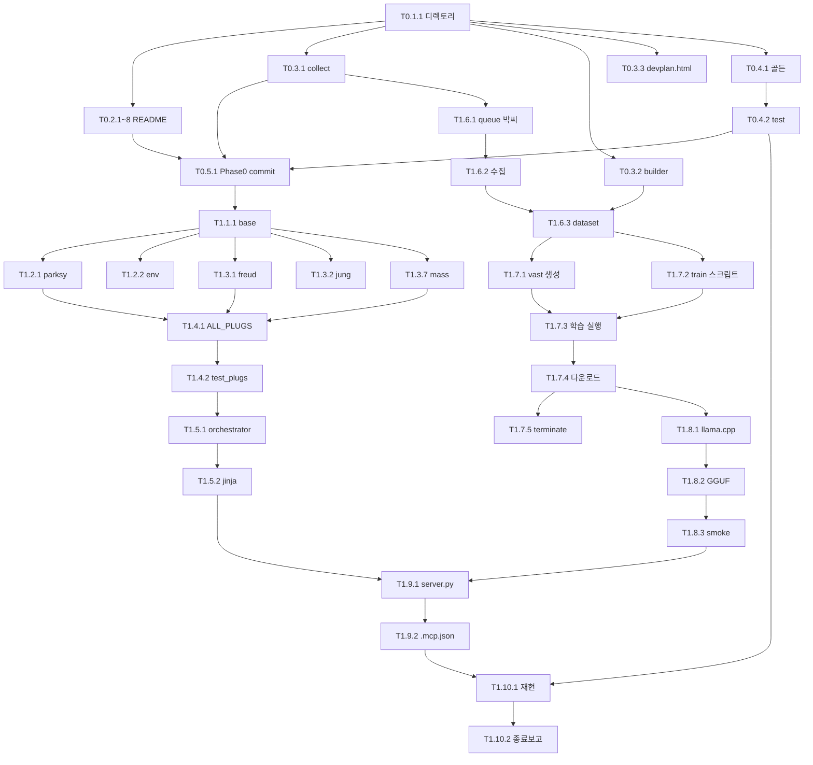

# MCP-THERAPY 에이전트 과업 카탈로그 (DEVPLAN v2)

**대상**: Alexandria MCP-Therapy Engine
**버전**: v2 (Agent-Ready Task Decomposition)
**선행**: `docs/MCP-THERAPY-WHITEPAPER-v0.2.md`, `docs/MCP-THERAPY-DEVPLAN.md`
**작성**: 2026-04-24 Claude Opus 4.7
**대상 에이전트**: Claude Code (Opus/Sonnet/Haiku), Aider + DeepSeek, Vast.ai 원격

> **원칙**: 이 문서의 모든 TASK는 에이전트가 **콜드 스타트**로 받아도 수행 가능하도록 자기완결성을 가진다. 박씨 또는 메인 관제(Claude Code Opus)가 이 카탈로그에서 TASK를 뽑아 라인에 던진다.

---

## 0. 메타 규칙 — 모든 에이전트가 반드시 읽는다

### 0.1 TASK 카드 표준 스키마

```yaml
TASK: T<phase>.<sprint>.<seq>
title: <짧은 목적>
agent_primary: <에이전트 ID>        # opus / sonnet / haiku / aider_deepseek / vastai_remote
agent_fallback: <대체 에이전트>
lane: <A|B|C|D|E>                   # 세션 라인
depends_on: [<TASK IDs>]
blocks: [<TASK IDs>]
estimated_min: <분>
risk_level: <low|med|high>

briefing: |
  에이전트가 콜드 스타트로 받을 때 필요한 최소 컨텍스트.
  - 이 TASK의 목적
  - 관련 파일 경로
  - 헌법 제약

instruction: |
  정확한 실행 순서. bash/python/파일경로 레벨.

verify: |
  완료 판정 bash 명령. exit 0 = 성공.

outputs:
  - <파일 경로 목록>

on_failure:
  - <폴백 액션>

commit_message: "<파피루스 헌법 포맷>"
```

### 0.2 에이전트 역할 정의

| 에이전트 | 강점 | 약점 | 할당 원칙 |
|---------|------|------|----------|
| **Opus (Lane A)** | 아키텍처, 복잡 로직, 번역/교차매핑 | 느림, 비쌈 | 신규 설계, 까다로운 플러그(Freud/Jung), 에러 진단 |
| **Sonnet (Lane B)** | 실행, 코딩, 속도 | 인프라 설계 약함 (feedback_infra_model_matching 메모리) | 케이스 큐레이션, JSONL 변환, 일반 구현 |
| **Haiku (Lane D)** | 빠름, 저비용 | 복잡 추론 한계 | 파일 템플릿, 간단 README, 리네이밍 |
| **Aider + DeepSeek (Lane C)** | 파일 diff 편집, 102K 컨텍스트 | 세션 재사용 한계 (feedback_telegram_claude_session) | 플러그 구현, 테스트 작성, 리팩토링 |
| **Vast.ai Remote (Lane E)** | GPU 학습 | SSH 딜레이, 비동기 | LoRA 학습 1회성 |

### 0.3 5-Lane 세션 매핑 (memory: project_mcp_deepseek_5lane)

| Lane | tmux 세션 | 디바이스 | 실행 명령 (세션 attach) |
|------|---------|---------|---------------------|
| A | `tab_claude` | Tab S9 → PC WSL2 | `ssh pc -t 'tmux attach -t tab_claude'` |
| B | `phone_claude` | S25 Ultra → PC WSL2 | `ssh pc -t 'tmux attach -t phone_claude'` |
| C | `phone_aider` | S25 Ultra → PC WSL2 | `ssh pc -t 'tmux attach -t phone_aider'` |
| D | `tab_aider` | Tab S9 → PC WSL2 | `ssh pc -t 'tmux attach -t tab_aider'` |
| E | Vast.ai | RTX 3090 | `ssh -p <port> root@<vast_ip>` |

### 0.4 공통 전제

모든 TASK 실행 전 보장:
- `cwd = ~/alexandria-sanctuary` (명시 없으면)
- 파피루스 헌법 준수 (squash 금지, revert만, secrets 커밋 금지)
- 박씨 직접 승인 없이는: GPU 과금, 신규 레포 생성, 외부 유료 API 호출 금지
- 커밋 메시지 끝에 `Co-Authored-By: Claude Opus 4.7 (1M context) <noreply@anthropic.com>` 필수

### 0.5 실패 시 에스컬레이션 체인

```
Lane D(Haiku) 실패 → Lane B(Sonnet) 재시도
Lane B(Sonnet) 실패 → Lane A(Opus) 에스컬
Lane C(Aider) 실패 → Lane B 또는 A로 재디스패치
Lane E(Vast.ai) 실패 → 박씨 채팅 보고 (비용 이슈)
```

### 0.6 TASK 호출 규약 (박씨 → 메인 관제)

박씨가 메인 관제에게:
- `"T1.3.4 실행"` — 단일 TASK
- `"T1.3.*"` — 스프린트 단위 배치
- `"T1.*"` — Phase 전체
- `"다음"` — 현재 `in_progress` 완료 후 의존성 해제된 다음 TASK 자동 선택

---

## 1. PHASE 0 — 씨앗 (1주, $0, 11개 TASK)

### Sprint 0.1 — 디렉토리 골격 (이미 완료)

#### TASK T0.1.1 ✅ (완료 2026-04-24)
```yaml
TASK: T0.1.1
title: MCP 엔진 디렉토리 골격 + .gitignore 생성
agent_primary: claude_opus (메인 관제)
lane: A
status: completed
verify: |
  test -d mcp/plugs && test -d library/freud && test -f .gitignore
outputs:
  - mcp/{plugs,prompts/per_school,models,train,tests/fixtures}/
  - library/{freud,jung,family,shaman_ko,sufi,ayahuasca,mass,parksy_seeds}/
  - private_seeds/
  - .gitignore
```

#### TASK T0.1.2 ✅ (완료 2026-04-24)
```yaml
TASK: T0.1.2
title: 학파 README 8장 플레이스홀더
agent_primary: claude_opus
status: completed
verify: |
  [ $(find library -name "README.md" | wc -l) -ge 8 ]
```

### Sprint 0.2 — 학파 README 상세화

#### TASK T0.2.1
```yaml
TASK: T0.2.1
title: library/freud/README.md 상세 작성
agent_primary: sonnet
agent_fallback: opus
lane: B
depends_on: [T0.1.2]
blocks: [T1.1.1_freud]
estimated_min: 20
risk_level: low

briefing: |
  Alexandria MCP-Therapy Phase 0. library/freud/에 저장될 Freud 학파
  케이스의 수집 가이드. FreudPlug (Gate I) 가 참조할 원천 데이터.
  핵심 개념 5개와 수집 대상 레퍼런스 10개 명시.

instruction: |
  1. 현재 library/freud/README.md (플레이스홀더) 내용 확인
  2. 아래 구조로 재작성:
     # library/freud
     ## 핵심 개념 5 (필수)
       - 소원성취 (wish fulfillment)
       - 응축 (condensation)
       - 전위 (displacement)
       - 초자아 (superego)
       - 오이디푸스 구도 + 방어기제
       각 개념당 3줄 설명
     ## 수집 대상 레퍼런스 10 (공개/접근가능 우선)
       - The Interpretation of Dreams (1900)
       - Beyond the Pleasure Principle (1920)
       - 기타 8권 또는 논문. URL/DOI 포함.
     ## JSONL 스키마 예시 (실제 채워진 1건)
     ## 수집 대기열
       박씨가 URL 추가할 자리 (비워둠)
  3. 박씨 톤 유지: "~거든", "~잖아" 남발하지 않되 단언적. Voice Filter 참조.

verify: |
  grep -q "핵심 개념" library/freud/README.md
  grep -q "수집 대상" library/freud/README.md
  [ $(wc -l < library/freud/README.md) -ge 60 ]

outputs:
  - library/freud/README.md (확장)

on_failure:
  - 플레이스홀더 버전 유지 + Phase 1 착수 시 박씨 직접 검토

commit_message: "docs: Freud 학파 수집 가이드 작성 (T0.2.1)"
```

#### TASK T0.2.2 ~ T0.2.8 (7개 동일 패턴)
```yaml
# 각 학파별 README.md 상세화, T0.2.1과 동일 포맷.
# T0.2.2: Jung     (Gate II, 원형/Self/개성화/동시성/집단무의식)
# T0.2.3: Family   (Gate IV, 보웬 분화/삼각관계/다세대 전승/가계도)
# T0.2.4: Shaman_ko (Gate V, 한/조상/터/굿/영매)
# T0.2.5: Sufi    (Gate III, 딸크/자크르/성자/빛/성지)
# T0.2.6: Ayahuasca (Gate V, 식물영/비전/해체-재조립/의례공간)
# T0.2.7: Mass    (Gate III+VII, 6단계 전례 + 상징학)
# T0.2.8: Parksy_seeds (박씨 로그 공개 가능분 큐레이션 기준)
#
# agent_primary: sonnet (전부 병렬 가능)
# lane: B
# depends_on: [T0.1.2]
# estimated_min: 20 each
# 주의: T0.2.7 (Mass)만 opus 사용 (박씨가 오늘 발견한 미사 = 1000년 임상
#       프레임이 핵심 설계 근거. 정확도 중요)
```

### Sprint 0.3 — 인프라 스크립트

#### TASK T0.3.1
```yaml
TASK: T0.3.1
title: collect_school_cases.py 작성 (케이스 자동 수집)
agent_primary: aider_deepseek
agent_fallback: sonnet
lane: C
depends_on: [T0.1.1]
blocks: [T1.4.*]
estimated_min: 45
risk_level: med

briefing: |
  박씨가 URL/PDF 경로를 sources_queue.json에 던지면,
  이 스크립트가 Claude API(sonnet)로 요약→JSONL 변환하여
  library/<school>/*.jsonl에 자동 저장. Phase 1 데이터 수집 핵심 도구.

instruction: |
  1. 파일 생성: mcp/train/collect_school_cases.py
  2. 의존성: anthropic, httpx, pypdf2 (requirements에 추가)
  3. 기능 요구:
     - CLI 인자: --queue <json> --school <name> --dry-run
     - sources_queue.json 스키마:
       [{"school":"freud", "url":"https://...", "added": "2026-04-24"}]
     - 각 원천에 대해:
       a. URL이면 httpx로 fetch, PDF이면 pypdf로 추출
       b. Claude API (model="claude-sonnet-4-6") 호출
          system: "당신은 {school} 학파 케이스 큐레이터."
          user: "다음 텍스트에서 {school} 관점의 케이스 1건을 백서 스키마 JSONL 1줄로 추출"
       c. 결과 검증: JSON 파싱 + 스키마 검증
       d. library/{school}/case_YYYYMMDD_NNN.jsonl 에 append
     - --dry-run: 저장 없이 출력만
  4. 에러 핸들링: fetch 실패 시 queue에 "failed: {reason}" 마킹
  5. 환경변수: ANTHROPIC_API_KEY (papyrus 로컬에서 로드)
  6. 예상 호출당 비용: ~$0.01 (Sonnet 입력 3K 출력 1K)

verify: |
  python3 mcp/train/collect_school_cases.py --help  # 에러 없음
  python3 -c "import mcp.train.collect_school_cases"  # import 가능

outputs:
  - mcp/train/collect_school_cases.py
  - mcp/train/sources_queue.json (빈 템플릿)
  - mcp/train/requirements.txt (anthropic, httpx, pypdf2)

on_failure:
  - 에러 로그 → phone_claude 세션에 에스컬
  - Sonnet이 수동 큐레이션 임시 fallback

commit_message: "feat: 케이스 자동 수집 스크립트 (T0.3.1)"
```

#### TASK T0.3.2
```yaml
TASK: T0.3.2
title: dataset_builder.py 작성 (library/*.jsonl → 학습셋 병합)
agent_primary: aider_deepseek
lane: C
depends_on: [T0.3.1]
blocks: [T1.6.1]
estimated_min: 30

instruction: |
  1. 파일: mcp/train/dataset_builder.py
  2. 기능:
     - library/**/*.jsonl 전부 glob
     - private_seeds/*.jsonl 추가 (존재 시)
     - ChatML 포맷 변환: {"messages": [{"role":"system","content":...}, ...]}
     - System 프롬프트: ParksyProfilePlug + per_school 템플릿 로드
     - Output: mcp/train/therapy_dataset_v1.jsonl
     - 통계 출력: 학파별 샘플 수, 총량
  3. CLI: --version v1 --min-samples 250 (검증)
  4. Validation: 최소 샘플 수 미달 시 exit 1

verify: |
  python3 mcp/train/dataset_builder.py --help
  # 실제 실행은 데이터 수집 후 T1.6.1에서

outputs:
  - mcp/train/dataset_builder.py

commit_message: "feat: 학습 데이터셋 빌더 (T0.3.2)"
```

#### TASK T0.3.3
```yaml
TASK: T0.3.3
title: devplan.html 대시보드 페이지 작성
agent_primary: sonnet
agent_fallback: opus
lane: B
depends_on: [T0.1.1]
blocks: []
estimated_min: 40

briefing: |
  박씨가 매일 접속해서 Phase 진척도 확인하는 체크리스트 UI.
  whitepaper.html과 동일 디자인 톤 (Cinzel, gold #C8A96E, parchment).
  JS로 localStorage에 체크 상태 저장.

instruction: |
  1. 파일: devplan.html (레포 루트)
  2. 디자인: whitepaper.html CSS 가져와 재사용
  3. 섹션:
     - Hero: "Development Log" + 진행률 바
     - Phase 0 체크리스트 (11개 TASK, 체크박스)
     - Phase 1 체크리스트 (70개 TASK, 접이식)
     - Phase 2/3 요약
  4. JS: localStorage['mcp_therapy_progress'] = {taskId: true/false}
     - 체크 시 저장, 리로드 시 복원
     - 전체 진행률 % 상단 표시
  5. nav/footer: index.html과 동일 패턴
  6. 모바일 반응형

verify: |
  test -f devplan.html
  grep -q "localStorage" devplan.html
  grep -q "Phase 0" devplan.html

outputs:
  - devplan.html

commit_message: "feat: 개발 진척 대시보드 페이지 (T0.3.3)"
```

### Sprint 0.4 — 재현 테스트 골든 셋

#### TASK T0.4.1
```yaml
TASK: T0.4.1
title: 2026-04-24 박씨 꿈 로그 → 골든 픽스처 추출
agent_primary: opus
agent_fallback: null
lane: A
depends_on: [T0.1.1]
blocks: [T1.10.1]
estimated_min: 30
risk_level: med

briefing: |
  ~/uploads/ParksyLog_20260424_082123.md (5808줄) 에서 박씨 꿈 진술문과
  최종 만점 리포트를 분리 추출. Phase 1 재현 테스트의 정답지.

instruction: |
  1. 원본 로그: ~/uploads/ParksyLog_20260424_082123.md
  2. 추출 대상 A: 박씨 1차 꿈 서술 (로그 12번 문장 "야 개꿈 인지는...")
     → mcp/tests/fixtures/parksy_dream_20260424_input.json
     스키마: {"narrative": "...", "metadata": {"is_dream": true, "date": "2026-04-24"}}
  3. 추출 대상 B: 박씨 2차 진술 (로그 1724번 문장 "이런 꿈을 사실은...")
     → mcp/tests/fixtures/parksy_dream_20260424_context.json
     스키마: {"sleep_context": {"location": "옛 방", "date": "2026-04-24",
             "sleep_quality": "good"}, "anniversary": "2026-03-13"}
  4. 추출 대상 C: Perplexity "최종 만점 분석 리포트" (로그 3115~3199줄 부근)
     → mcp/tests/fixtures/parksy_dream_20260424_golden.json
     스키마: {
       "one_line": "...",
       "active_plugs": ["freud", "jung", "family_systems", "env_trigger",
                        "narrative_meta", "shaman_ko"],
       "key_terms": ["grief", "guilt", "eros", "rage", "돌봄 OS 종료",
                     "케어 없는 상태의 나 테스트 런"]
     }
  5. 민감 정보 처리:
     - 어머니/작은누나 건강 세부 원문은 fixtures 에 그대로 두되
     - .gitignore 에 mcp/tests/fixtures/parksy_dream_* 추가 (private)
     - 공개용 sanitized 버전은 별도 fixture 필요 시 Phase 2에서
  6. fixture 생성 후 .gitignore 에 다음 추가:
     mcp/tests/fixtures/parksy_dream_*.json

verify: |
  test -f mcp/tests/fixtures/parksy_dream_20260424_input.json
  test -f mcp/tests/fixtures/parksy_dream_20260424_golden.json
  python3 -c "import json; json.load(open('mcp/tests/fixtures/parksy_dream_20260424_input.json'))"
  grep -q "parksy_dream_" .gitignore

outputs:
  - mcp/tests/fixtures/parksy_dream_20260424_input.json
  - mcp/tests/fixtures/parksy_dream_20260424_context.json
  - mcp/tests/fixtures/parksy_dream_20260424_golden.json
  - .gitignore 업데이트

on_failure:
  - Opus가 로그 직접 읽고 수동 추출 (민감정보 필터링 신중)

commit_message: "test: 2026-04-24 골든 픽스처 추가 (T0.4.1)"
```

#### TASK T0.4.2
```yaml
TASK: T0.4.2
title: 재현 테스트 스켈레톤 test_replay_20260424.py
agent_primary: aider_deepseek
lane: C
depends_on: [T0.4.1]
blocks: [T1.10.1]
estimated_min: 25

instruction: |
  1. 파일: mcp/tests/test_replay_20260424.py
  2. pytest 형식
  3. 테스트 3개:
     a. test_input_fixture_loads: 입력 JSON 로드 OK
     b. test_golden_plugs_present: golden에 active_plugs 최소 6개 존재
     c. test_replay_accuracy (Phase 1 이후 동작):
        - plug_orchestrator.analyze_dream(input) 호출
        - 결과의 active_plugs ∩ golden.active_plugs / golden 개수 >= 0.80
        - key_terms 중 ≥ 60% 출력에 등장
  4. Phase 0에선 a, b만 통과해야 함. c는 @pytest.mark.skip("Phase 1 dependency")
  5. requirements: pytest

verify: |
  pytest mcp/tests/test_replay_20260424.py::test_input_fixture_loads -v
  pytest mcp/tests/test_replay_20260424.py::test_golden_plugs_present -v

outputs:
  - mcp/tests/test_replay_20260424.py
  - mcp/tests/__init__.py
  - mcp/tests/conftest.py (pytest 설정)

commit_message: "test: 재현 테스트 스켈레톤 (T0.4.2)"
```

### Sprint 0.5 — Phase 0 커밋 + 검증

#### TASK T0.5.1
```yaml
TASK: T0.5.1
title: Phase 0 전체 커밋 푸시 + devplan.html 배포 확인
agent_primary: opus
lane: A
depends_on: [T0.2.1, T0.2.2, T0.2.3, T0.2.4, T0.2.5, T0.2.6, T0.2.7, T0.2.8,
             T0.3.1, T0.3.2, T0.3.3, T0.4.1, T0.4.2]
blocks: [T1.*]
estimated_min: 15

instruction: |
  1. git status 확인
  2. 민감 파일 있는지 최종 확인 (private_seeds, fixtures)
  3. 박씨에게 커밋 목록 브리핑 후 승인 대기
  4. 승인 시 커밋 → push
  5. GitHub Pages 빌드 확인 (whitepaper.html, devplan.html 접근 가능)
  6. 박씨 폰에서 접속 테스트 요청

verify: |
  git log --oneline -5
  curl -s -o /dev/null -w "%{http_code}" https://dtslib1979.github.io/alexandria-sanctuary/whitepaper.html
  # 200 응답 확인

commit_message: "feat: Phase 0 종료 — MCP-Therapy 씨앗 완료"
```

---

## 2. PHASE 1 — MVP (2주, $2, 70개 TASK)

### Week 1: 데이터 + 엔진 골격

### Sprint 1.1 — 플러그 베이스 클래스

#### TASK T1.1.1
```yaml
TASK: T1.1.1
title: mcp/plugs/base.py + __init__.py
agent_primary: aider_deepseek
lane: C
depends_on: [T0.5.1]
blocks: [T1.2.*, T1.3.*]
estimated_min: 20
risk_level: low

briefing: |
  모든 플러그가 상속할 추상 베이스. 가중치 계산 로직의 공통 토대.
  백서 §4.1과 §4.3 준수.

instruction: |
  1. 파일: mcp/plugs/base.py
  2. 코드:
     ```python
     from abc import ABC, abstractmethod
     from typing import Optional

     class Plug(ABC):
         name: str = ""
         gate_id: Optional[str] = None
         weight_default: float = 0.10
         keywords_trigger: list[str] = []

         def score(self, ctx: dict) -> float:
             narrative = ctx.get("narrative", "")
             hits = sum(1 for k in self.keywords_trigger if k in narrative)
             base = self.weight_default + hits * 0.08
             return min(base, 0.45)

         @abstractmethod
         def frame(self, ctx: dict) -> dict:
             """해석 프레임을 프롬프트 변수로 반환"""
             ...
     ```
  3. 파일: mcp/plugs/__init__.py
     - ALL_PLUGS 리스트 (각 플러그 구현 완료 시 import 추가)
     - 초기엔 빈 리스트
  4. 파일: mcp/__init__.py (빈 파일)

verify: |
  python3 -c "from mcp.plugs.base import Plug; print(Plug.__name__)"
  python3 -c "from mcp.plugs import ALL_PLUGS; assert isinstance(ALL_PLUGS, list)"

outputs:
  - mcp/__init__.py
  - mcp/plugs/__init__.py
  - mcp/plugs/base.py

commit_message: "feat: Plug 추상 베이스 (T1.1.1)"
```

### Sprint 1.2 — 백그라운드 플러그 2종 (항상 작동)

#### TASK T1.2.1
```yaml
TASK: T1.2.1
title: ParksyProfilePlug 구현 (가중치 고정 1.0)
agent_primary: sonnet
lane: B
depends_on: [T1.1.1]
blocks: [T1.4.1]
estimated_min: 20
risk_level: low

briefing: |
  모든 입력에 대해 박씨 톤을 강제하는 플러그. 가중치 고정 1.0.
  ~/dtslib-papyrus/filters/parksy_voice_filter.md 로드.

instruction: |
  1. 파일: mcp/plugs/parksy_profile.py
  2. 코드:
     ```python
     from pathlib import Path
     from mcp.plugs.base import Plug

     VOICE_FILTER_PATH = Path.home() / "dtslib-papyrus" / "filters" / "parksy_voice_filter.md"

     class ParksyProfilePlug(Plug):
         name = "parksy_profile"
         gate_id = None  # 백그라운드
         weight_default = 1.0
         keywords_trigger = []

         def score(self, ctx: dict) -> float:
             return 1.0  # 항상 고정

         def frame(self, ctx: dict) -> dict:
             tone_rules = ""
             if VOICE_FILTER_PATH.exists():
                 tone_rules = VOICE_FILTER_PATH.read_text(encoding="utf-8")
             return {
                 "name": "parksy_profile",
                 "gate": None,
                 "tone_rules": tone_rules,
                 "directive": "출력 톤: 짧고 직설. 존댓말 금지. 단언형 종결. 설명 전 즉시 핵심.",
                 "verdict_template": "참고. 네 판단이 최종이다. 레시피 아님, 레퍼런스임."
             }
     ```
  3. mcp/plugs/__init__.py 업데이트:
     ALL_PLUGS에 ParksyProfilePlug() 추가

verify: |
  python3 -c "
  from mcp.plugs.parksy_profile import ParksyProfilePlug
  p = ParksyProfilePlug()
  assert p.score({}) == 1.0
  frame = p.frame({'narrative': 'test'})
  assert 'verdict_template' in frame
  "

outputs:
  - mcp/plugs/parksy_profile.py
  - mcp/plugs/__init__.py (수정)

commit_message: "feat: ParksyProfilePlug (T1.2.1)"
```

#### TASK T1.2.2
```yaml
TASK: T1.2.2
title: EnvTriggerPlug 구현 (장소·날짜·애니버서리)
agent_primary: sonnet
lane: B
depends_on: [T1.1.1]
blocks: [T1.4.2]
estimated_min: 25

briefing: |
  수면 환경·날짜·기일 감지. 옛 방/3-13 같은 박씨 특수 기념일 감지 시
  가중치 크게 부스팅. EnvTrigger는 Gate 매칭 없는 백그라운드.

instruction: |
  1. 파일: mcp/plugs/env_trigger.py
  2. 키워드: ["옛 방", "예전 집", "어릴 적", "고향", "기일", "제사",
             "창립기념일", "봄", "가을", "명절"]
  3. 박씨 특수 날짜 하드코딩 (metadata 감지용):
     PARKSY_ANNIVERSARIES = {
       "03-13": ["창립기념일", "어머니 요양원 입소일"],
       # 추가는 박씨 큐레이션으로
     }
  4. score():
     - 키워드 히트: +0.08 per hit
     - metadata.date가 anniversary ±30일: +0.5
     - metadata.location == "옛 방" / "예전 집": +0.3
  5. frame() 반환:
     - detected_anniversaries: []
     - detected_location: ""
     - directive: "장소-기억, 애니버서리 효과 해석 강제"

verify: |
  python3 -c "
  from mcp.plugs.env_trigger import EnvTriggerPlug
  p = EnvTriggerPlug()
  ctx = {'narrative': '옛 방에서 잤다', 'metadata': {'date': '2026-03-13'}}
  assert p.score(ctx) > 0.5
  "

outputs:
  - mcp/plugs/env_trigger.py
  - mcp/plugs/__init__.py (추가)

commit_message: "feat: EnvTriggerPlug + 박씨 애니버서리 (T1.2.2)"
```

### Sprint 1.3 — 7 Gate 플러그 구현 (병렬 가능)

#### TASK T1.3.1 — FreudPlug (Gate I)
```yaml
TASK: T1.3.1
title: FreudPlug 구현 (Gate I)
agent_primary: opus
agent_fallback: aider_deepseek
lane: A
depends_on: [T1.1.1, T0.2.1]
blocks: [T1.4.3]
estimated_min: 35
risk_level: med

briefing: |
  Freud 학파 해석 프레임. "엄마 죽이고 싶은 충동" 과장 금지 조항 중요.
  백서 부록 A의 FreudPlug 스켈레톤 준수. library/freud/README.md 먼저 읽기.

instruction: |
  1. library/freud/README.md 읽어 핵심 개념 5개 확인
  2. 파일: mcp/plugs/freud.py
  3. 구현 스펙:
     name = "freud"
     gate_id = "I"
     weight_default = 0.10
     keywords_trigger = ["죽음", "부모", "아버지", "어머니", "성", "욕망",
                         "죄책감", "병신", "업소", "초자아", "오이디푸스"]

     score() 추가 로직:
       if metadata.get("is_dream"): base += 0.15

     frame() 반환:
       {
         "name": "freud",
         "gate": "I",
         "lens": "소원성취 · 응축 · 전위 · 초자아",
         "questions": [
           "이 꿈에서 위장된 소원은 무엇인가?",
           "표면 내용 뒤의 잠재 내용은?",
           "초자아가 어떤 목소리로 등장했는가?"
         ],
         "cautions": [
           "'엄마 죽이고 싶은 충동' 환원은 금지",
           "죽음 꿈 = 상황 종결 해석 우선",
           "업소/성욕을 과장하지 말고 외로움의 기호로 읽기"
         ],
         "parksy_specific": {
           "죄책감_외부화": "모르는 타인의 비난 = 자기 비난의 투사",
           "애도": "치매·가난 시스템의 종결 욕구"
         }
       }
  4. mcp/plugs/__init__.py에 추가

verify: |
  python3 -c "
  from mcp.plugs.freud import FreudPlug
  p = FreudPlug()
  assert p.gate_id == 'I'
  ctx = {'narrative': '어머니가 꿈에 나왔다', 'metadata': {'is_dream': True}}
  assert p.score(ctx) > 0.2
  frame = p.frame(ctx)
  assert '위장된 소원' in str(frame['questions'])
  "

outputs:
  - mcp/plugs/freud.py

commit_message: "feat: FreudPlug (Gate I, T1.3.1)"
```

#### TASK T1.3.2 — JungPlug (Gate II)
```yaml
TASK: T1.3.2
title: JungPlug 구현 (Gate II — Dissolution of Self)
agent_primary: opus
lane: A
depends_on: [T1.1.1, T0.2.2]
blocks: [T1.4.3]
estimated_min: 35

instruction: |
  1. 파일: mcp/plugs/jung.py
  2. 스펙:
     name = "jung"
     gate_id = "II"
     keywords = ["지휘자", "만다라", "그림자", "페르소나", "아니마", "아니무스",
                 "Self", "원형", "개성화", "집단무의식", "동시성", "통합"]
     score() 특수: is_dream → +0.15
     frame() 중점:
       - "지휘자/오케스트라 이미지" = Self 통합 상징
       - "죽음→재생" 개성화 과정
       - 2026-04-24 박씨 꿈 핵심 (지휘 장면) 반영
       cautions: "집단무의식 용어 남발 금지, 구체적 이미지 중심"

verify: |
  python3 -c "
  from mcp.plugs.jung import JungPlug
  ctx = {'narrative': '어머니가 오케스트라를 지휘했다', 'metadata': {'is_dream': True}}
  assert JungPlug().score(ctx) > 0.25
  "

commit_message: "feat: JungPlug (Gate II, T1.3.2)"
```

#### TASK T1.3.3 — FamilySystemsPlug (Gate IV)
```yaml
TASK: T1.3.3
title: FamilySystemsPlug (Gate IV — Inside & Outside)
agent_primary: sonnet
lane: B
depends_on: [T1.1.1, T0.2.3]
estimated_min: 30

instruction: |
  1. 파일: mcp/plugs/family.py
  2. 스펙:
     name = "family_systems"
     gate_id = "IV"
     keywords = ["부양", "책임", "동거", "의무", "부양자", "가족", "간병",
                 "돌봄", "삼각관계", "누나", "형제", "부모"]
     score(): metadata.is_family_event → +0.25
     frame() 프레임:
       - 보웬 분화 수준
       - 삼각관계 탐지
       - 다세대 전승 패턴
       - 박씨 특수: "의무부양자 → 분리 독립 → 이식형 관계"

commit_message: "feat: FamilySystemsPlug (Gate IV, T1.3.3)"
```

#### TASK T1.3.4 — ShamanKoPlug (Gate V)
```yaml
TASK: T1.3.4
title: ShamanKoPlug (Gate V — Sound & Soul, 한국 무속)
agent_primary: sonnet
lane: B
depends_on: [T1.1.1, T0.2.4]
estimated_min: 30

instruction: |
  1. 파일: mcp/plugs/shaman_ko.py
  2. 스펙:
     name = "shaman_ko"
     gate_id = "V"
     keywords = ["제사", "묘소", "조상", "터", "한", "굿", "영매",
                 "귀신", "넋", "혼", "기일"]
     frame():
       - 조상 방문 해석 옵션
       - 터 기운 / 집안 내력
       - 한(恨)의 유전
       cautions: "무속=가짜 주장 회피, 패턴 데이터로 해석"
       박씨_specific: "미신 신봉 아님 — 레퍼런스로만 사용"

commit_message: "feat: ShamanKoPlug (Gate V, T1.3.4)"
```

#### TASK T1.3.5 — SufiPlug (Gate III)
```yaml
TASK: T1.3.5
title: SufiPlug (Gate III — Touch of God, 수피 힐링)
agent_primary: sonnet
lane: B
depends_on: [T1.1.1, T0.2.5]
estimated_min: 25

instruction: |
  1. 파일: mcp/plugs/sufi.py
  2. 스펙:
     name = "sufi"
     gate_id = "III"
     keywords = ["성지", "기도", "빛", "성자", "사랑", "비움", "통곡"]
     frame():
       - 딸크(기도) / 자크르(호흡+리듬)
       - 성자 숭배 vs 정신의학 대비
       - 박씨에겐 "의식적 비움" 메타포만 유효

commit_message: "feat: SufiPlug (Gate III, T1.3.5)"
```

#### TASK T1.3.6 — AyahuascaPlug (Gate V 공유)
```yaml
TASK: T1.3.6
title: AyahuascaPlug (Gate V — 식물 영, 비전)
agent_primary: sonnet
lane: B
depends_on: [T1.1.1, T0.2.6]
estimated_min: 25

instruction: |
  1. 파일: mcp/plugs/ayahuasca.py
  2. 스펙:
     name = "ayahuasca"
     gate_id = "V"
     keywords = ["비전", "식물", "정글", "해체", "각성", "환각", "자기해체"]
     frame():
       - 해체-재조립 구조
       - 비전 = 무의식/Self 만남 번역
       cautions: "실제 의례 약물 복용 권장 금지"

commit_message: "feat: AyahuascaPlug (Gate V share, T1.3.6)"
```

#### TASK T1.3.7 — MassProtocolPlug (Gate III + VII) ⭐ 중요
```yaml
TASK: T1.3.7
title: MassProtocolPlug (Gate III + VII — 천주교 미사 6단계)
agent_primary: opus
agent_fallback: null
lane: A
depends_on: [T1.1.1, T0.2.7]
blocks: [T1.4.4, T1.7.3]
estimated_min: 45
risk_level: med

briefing: |
  본 엔진의 핵심 이론적 앵커. 천주교 미사 = 1000년 임상 완료된
  표준화 샤먼 OS. 박씨 2026-04-24 로그에서 직접 도달한 결론.
  6단계 프로토콜이 propose_ritual 도구의 베이스.

instruction: |
  1. library/mass/README.md 먼저 읽기 (T0.2.7 산출물)
  2. 파일: mcp/plugs/mass.py
  3. 스펙:
     name = "mass_protocol"
     gate_id = "III"  # 1차
     secondary_gate_id = "VII"  # 파견 단계
     keywords = ["미사", "고해", "전례", "파견", "공동체", "용서",
                 "구원", "봉헌", "성체", "화해"]

     score():
       if "파견" in narrative or "마무리" in narrative: +0.2

     frame() 반환:
       {
         "name": "mass_protocol",
         "gate": "III",
         "lens": "표준화된 영성 프로토콜",
         "six_stages": [
           {"stage": 1, "name": "입당 (Introit)", "mcp_action": "session_start"},
           {"stage": 2, "name": "말씀 전례 (Liturgy of Word)", "mcp_action": "analyze_narrative"},
           {"stage": 3, "name": "복음/강론 (Homily)", "mcp_action": "plug_weighted_report"},
           {"stage": 4, "name": "봉헌 (Offertory)", "mcp_action": "user_curation"},
           {"stage": 5, "name": "성체성사 (Eucharist)", "mcp_action": "propose_ritual"},
           {"stage": 6, "name": "파견 (Dismissal)", "mcp_action": "session_end"}
         ],
         "parksy_context": "1000년 임상실험 통과. 샤먼 자동화 불가 명제의 반례.",
         "usage": "propose_ritual 호출 시 이 6단계가 기본 템플릿"
       }
  4. mcp/plugs/__init__.py에 추가

verify: |
  python3 -c "
  from mcp.plugs.mass import MassProtocolPlug
  p = MassProtocolPlug()
  frame = p.frame({'narrative': '미사 후 마음이 편했다'})
  assert len(frame['six_stages']) == 6
  assert frame['six_stages'][5]['name'].startswith('파견')
  "

outputs:
  - mcp/plugs/mass.py

commit_message: "feat: MassProtocolPlug — 1000년 임상 프로토콜 (T1.3.7)"
```

#### TASK T1.3.8 — NarrativeMetaPlug (Gate VI)
```yaml
TASK: T1.3.8
title: NarrativeMetaPlug (Gate VI — Forbidden Gate, 꿈 속 추론)
agent_primary: opus
lane: A
depends_on: [T1.1.1]
estimated_min: 30

briefing: |
  박씨 꿈의 2차 메타텍스트 감지. "꿈 속에서 스스로 추론했다"는 구조가
  등장하면 가중치 부스팅. 박씨 2026-04-24 로그의 "업소여성일 거라고
  추론했다" 부분이 대표 사례.

instruction: |
  1. 파일: mcp/plugs/narrative_meta.py
  2. 스펙:
     name = "narrative_meta"
     gate_id = "VI"
     keywords = ["추론했", "돌이켜보니", "알고 보니", "생각해보면",
                 "아마", "추측", "꿈속에서도"]

     score():
       메타 인식 구조 감지:
       if any(k in narrative for k in ["꿈 속에서", "꿈속에서"]) and
          any(k in narrative for k in ["추론", "생각", "아마"]):
         base += 0.25

     frame():
       lens = "꿈의 2차 메타텍스트 — 주체가 꿈 안에서 자기 해석"
       directive = "라캉: 주체가 타자의 욕망을 되물음"
       insight = "박씨 스스로 이미 해석 모드. 단순 해석 제공 말고 '네가
                  이미 디버깅 중이다' 언급"

commit_message: "feat: NarrativeMetaPlug (Gate VI, T1.3.8)"
```

### Sprint 1.4 — 플러그 레지스트리 완성 & 통합 테스트

#### TASK T1.4.1
```yaml
TASK: T1.4.1
title: mcp/plugs/__init__.py ALL_PLUGS 완성
agent_primary: aider_deepseek
lane: C
depends_on: [T1.2.1, T1.2.2, T1.3.1, T1.3.2, T1.3.3, T1.3.4, T1.3.5, T1.3.6, T1.3.7, T1.3.8]
blocks: [T1.5.1]
estimated_min: 10

instruction: |
  mcp/plugs/__init__.py:
    from mcp.plugs.parksy_profile import ParksyProfilePlug
    from mcp.plugs.env_trigger import EnvTriggerPlug
    from mcp.plugs.freud import FreudPlug
    from mcp.plugs.jung import JungPlug
    from mcp.plugs.family import FamilySystemsPlug
    from mcp.plugs.shaman_ko import ShamanKoPlug
    from mcp.plugs.sufi import SufiPlug
    from mcp.plugs.ayahuasca import AyahuascaPlug
    from mcp.plugs.mass import MassProtocolPlug
    from mcp.plugs.narrative_meta import NarrativeMetaPlug

    ALL_PLUGS = [
        ParksyProfilePlug(),
        EnvTriggerPlug(),
        FreudPlug(),
        JungPlug(),
        FamilySystemsPlug(),
        ShamanKoPlug(),
        SufiPlug(),
        AyahuascaPlug(),
        MassProtocolPlug(),
        NarrativeMetaPlug(),
    ]

verify: |
  python3 -c "from mcp.plugs import ALL_PLUGS; assert len(ALL_PLUGS) == 10"

commit_message: "feat: ALL_PLUGS 레지스트리 완성 (T1.4.1)"
```

#### TASK T1.4.2
```yaml
TASK: T1.4.2
title: 플러그 단위 테스트 (mcp/tests/test_plugs.py)
agent_primary: aider_deepseek
lane: C
depends_on: [T1.4.1]
blocks: [T1.5.1]
estimated_min: 30

instruction: |
  1. 파일: mcp/tests/test_plugs.py
  2. 테스트:
     - test_all_plugs_load: ALL_PLUGS == 10
     - test_all_plugs_have_name: 각 name 유일
     - test_all_plugs_score_returns_float: score() ∈ [0.0, 1.0]
     - test_all_plugs_frame_returns_dict: frame() 딕셔너리 + 필수 키
     - test_parksy_profile_always_one: score = 1.0 고정
     - test_gate_ids_valid: gate_id ∈ {None, 'I'~'VII'}
     - test_keywords_are_lists: keywords_trigger 리스트 타입
  3. pytest 실행 → 전부 통과

verify: |
  pytest mcp/tests/test_plugs.py -v
  # 모든 테스트 PASS

commit_message: "test: 플러그 단위 테스트 (T1.4.2)"
```

### Sprint 1.5 — Plug Orchestrator

#### TASK T1.5.1
```yaml
TASK: T1.5.1
title: plug_orchestrator.py — 가중치 계산 + 프롬프트 빌더
agent_primary: opus
agent_fallback: aider_deepseek
lane: A
depends_on: [T1.4.1, T1.4.2]
blocks: [T1.6.*, T1.9.*]
estimated_min: 60
risk_level: high

briefing: |
  엔진 심장부. 박씨가 2026-04-24 로그에서 직접 제안한 "선형 파이썬 코드로
  확률 분포 강제" 로직의 구현체.

instruction: |
  1. 파일: mcp/plug_orchestrator.py
  2. 함수 3개:

     def compute_weights(narrative, metadata=None, forced_gate=None) -> dict:
         # 백서 §4.3 로직 그대로
         metadata = metadata or {}
         weights = {}
         for p in ALL_PLUGS:
             weights[p.name] = p.score({"narrative": narrative, "metadata": metadata})
         if metadata.get("is_dream"):
             weights["freud"] = weights.get("freud", 0) + 0.3
             weights["jung"] = weights.get("jung", 0) + 0.3
         if metadata.get("is_family_event"):
             weights["family_systems"] = weights.get("family_systems", 0) + 0.4
         if metadata.get("anniversary_within_30d"):
             weights["env_trigger"] = weights.get("env_trigger", 0) + 0.5
         if forced_gate:
             for p in ALL_PLUGS:
                 if p.gate_id == forced_gate:
                     weights[p.name] = weights.get(p.name, 0) + 0.5
         weights["parksy_profile"] = 1.0
         return _normalize(weights, lock=["parksy_profile"])

     def compose_prompt(narrative, metadata=None, forced_gate=None) -> str:
         weights = compute_weights(narrative, metadata, forced_gate)
         frames = {p.name: p.frame({"narrative": narrative, "metadata": metadata or {}})
                   for p in ALL_PLUGS if weights.get(p.name, 0) > 0.05}
         env = Environment(loader=FileSystemLoader("mcp/prompts"))
         tmpl = env.get_template("therapy_system.jinja")
         return tmpl.render(weights=weights, frames=frames, narrative=narrative)

     def _normalize(weights, lock=None):
         lock = lock or []
         movable = {k: v for k, v in weights.items() if k not in lock}
         total = sum(movable.values())
         if total > 0:
             for k in movable:
                 weights[k] = movable[k] / total * (1.0 - sum(weights[l] for l in lock if l in weights) * 0.0)
         return weights

  3. 의존성: jinja2 (requirements 추가)
  4. 엣지 케이스:
     - narrative == "" → weights 전부 기본값, parksy_profile만 1.0
     - forced_gate 존재하지 않는 값 ('X') → 무시

verify: |
  python3 -c "
  from mcp.plug_orchestrator import compute_weights, compose_prompt
  w = compute_weights('어머니가 꿈에 나왔다', {'is_dream': True})
  assert w['parksy_profile'] == 1.0
  assert w['freud'] > 0.1
  assert w['jung'] > 0.1
  print('weights OK:', sorted(w.items(), key=lambda x: -x[1])[:5])
  "

outputs:
  - mcp/plug_orchestrator.py

commit_message: "feat: Plug Orchestrator 핵심 로직 (T1.5.1)"
```

#### TASK T1.5.2
```yaml
TASK: T1.5.2
title: therapy_system.jinja 마스터 시스템 프롬프트
agent_primary: opus
lane: A
depends_on: [T1.5.1]
blocks: [T1.6.*]
estimated_min: 40
risk_level: high

instruction: |
  1. 파일: mcp/prompts/therapy_system.jinja
  2. 구조:
     ```jinja
     # Alexandria MCP-Therapy Engine — Session

     ## 톤 규칙 (고정)
     {{ frames.parksy_profile.directive }}

     ## 활성 플러그 (가중치 순)
     
     
     - **{{ name }}** (Gate {{ frames[name].gate or '—' }}, weight {{ '%.2f' | format(weight) }})
       렌즈: {{ frames[name].lens | default('') }}
       주의: {{ frames[name].cautions | join(', ') }}
     
     

     ## 사용자 입력
     {{ narrative }}

     ## 출력 규칙
     1. one_line: 핵심을 한 문장으로 요약
     2. layered_analysis: grief/guilt/eros/rage 4층 분석
     3. dissenting_views: 소수 의견 플러그의 대안 해석 1~2개
     4. suggested_ritual: 해당하면 미사 6단계 중 한 스텝 제안
     5. parksy_tone_verdict: {{ frames.parksy_profile.verdict_template }}

     ## 금지
     - 존댓말
     - 의료/약물/처방 언급
     - "꼭 ~해야 한다" 강제형
     - 학파 용어 남발 (프로이트 용어 3개 이하)

     ## 출력 포맷: JSON
     ```

  3. per_school/*.jinja 별도 템플릿 (선택, Phase 1 완화 가능)

verify: |
  python3 -c "
  from mcp.plug_orchestrator import compose_prompt
  prompt = compose_prompt('어머니가 꿈에 나왔다', {'is_dream': True})
  assert '활성 플러그' in prompt
  assert 'parksy_tone_verdict' in prompt
  print(prompt[:500])
  "

outputs:
  - mcp/prompts/therapy_system.jinja

commit_message: "feat: 마스터 시스템 프롬프트 (T1.5.2)"
```

### Sprint 1.6 — 데이터 수집 & 학습셋 빌드

#### TASK T1.6.1 (박씨 협업)
```yaml
TASK: T1.6.1
title: sources_queue.json 초기 10건 채우기 (박씨 직접)
agent_primary: human (박씨)
agent_assistant: sonnet
lane: B (assistant)
depends_on: [T0.3.1]
blocks: [T1.6.2]
estimated_min: 30

instruction: |
  [박씨에게 안내]
  1. mcp/train/sources_queue.json에 학파별 URL 각 1~2개 추가 (총 10건)
  2. 형식:
     [
       {"school": "freud", "url": "https://..."},
       {"school": "jung", "url": "https://..."},
       ...
     ]
  3. URL이 PDF면 "type": "pdf" 추가
  4. Sonnet이 박씨 구두 지시 ("Freud 꿈 해석 논문 찾아줘") 받아 보조

verify: |
  python3 -c "
  import json
  q = json.load(open('mcp/train/sources_queue.json'))
  assert len(q) >= 10
  schools = {item['school'] for item in q}
  assert len(schools) >= 6
  "

commit_message: "chore: 케이스 수집 대기열 초기화 (T1.6.1)"
```

#### TASK T1.6.2
```yaml
TASK: T1.6.2
title: 배치 케이스 수집 실행 (~220 케이스)
agent_primary: sonnet (collect_school_cases.py 호출)
lane: B
depends_on: [T1.6.1, T0.3.1]
blocks: [T1.6.3]
estimated_min: 180  # 3시간 배치
risk_level: med
cost_estimate: "$2 (Claude Sonnet API)"

instruction: |
  1. 환경 확인: ANTHROPIC_API_KEY 존재
  2. 실행:
     cd ~/alexandria-sanctuary
     python3 mcp/train/collect_school_cases.py \
       --queue mcp/train/sources_queue.json \
       --batch-size 5 --parallel 3
  3. 진행 중 tmux 세션 phone_claude 에서 모니터링
  4. 실패 항목 큐에 남김 → 박씨 재큐레이션
  5. 목표: library/*/에 최소 200 JSONL

verify: |
  total=$(find library -name "*.jsonl" | xargs wc -l | tail -1 | awk '{print $1}')
  [ $total -ge 200 ]

outputs:
  - library/freud/*.jsonl (50+)
  - library/jung/*.jsonl (50+)
  - library/family/*.jsonl (40+)
  - library/shaman_ko/*.jsonl (30+)
  - library/sufi/*.jsonl (20+)
  - library/ayahuasca/*.jsonl (15+)
  - library/mass/*.jsonl (15+)

on_failure:
  - API 비용 초과 → 박씨 승인 대기
  - Claude 요약 품질 낮음 → Opus로 대체

commit_message: "feat: 케이스 220+ 자동 수집 (T1.6.2)"
```

#### TASK T1.6.3
```yaml
TASK: T1.6.3
title: therapy_dataset_v1.jsonl 빌드 (250+ 샘플)
agent_primary: aider_deepseek
lane: C
depends_on: [T1.6.2, T0.3.2]
blocks: [T1.7.1]
estimated_min: 10

instruction: |
  python3 mcp/train/dataset_builder.py --version v1 --min-samples 250
  # 통계 출력 확인:
  #   freud: 50 / jung: 50 / family: 40 / ...

verify: |
  test -f mcp/train/therapy_dataset_v1.jsonl
  [ $(wc -l < mcp/train/therapy_dataset_v1.jsonl) -ge 250 ]

outputs:
  - mcp/train/therapy_dataset_v1.jsonl

commit_message: "feat: 학습셋 v1 빌드 (T1.6.3)"
```

### Sprint 1.7 — Vast.ai LoRA 학습

#### TASK T1.7.1
```yaml
TASK: T1.7.1
title: Vast.ai 인스턴스 프로비저닝 (RTX 3090)
agent_primary: opus (박씨 GPU 승인 후)
lane: A
depends_on: [T1.6.3]
blocks: [T1.7.2]
estimated_min: 15
risk_level: high
cost_estimate: "$0 (인스턴스 생성만, 실제 과금은 실행 시간)"
requires_approval: "박씨 GPU 과금 승인"

instruction: |
  1. 박씨 채팅 "Vast.ai 학습 시작해" 승인 받음
  2. 검색:
     vastai search offers 'gpu_name=RTX_3090 reliability>0.95 dph<0.25' \
       --order 'dph+' --limit 5
  3. 선택 (최저가 + 평판 높은 것):
     vastai create instance <ID> \
       --image pytorch/pytorch:2.1.0-cuda12.1-cudnn8-devel \
       --disk 50 \
       --onstart-cmd "pip install peft==0.7.1 accelerate bitsandbytes transformers datasets"
  4. SSH 정보 확보 (GraphQL 직접, SDK 금지 — memory: project_runpod_master_solution)
  5. 학습 데이터 scp:
     scp -P <port> mcp/train/therapy_dataset_v1.jsonl root@<ip>:/workspace/
     scp -P <port> mcp/train/train_lora.py root@<ip>:/workspace/

verify: |
  ssh -p <port> root@<ip> "ls /workspace/therapy_dataset_v1.jsonl"

outputs:
  - Vast.ai 인스턴스 running
  - /workspace/therapy_dataset_v1.jsonl (원격)

on_failure:
  - RTX 3090 재고 0 → RTX 4090 대안 (박씨 승인)
  - 네트워크 이슈 → 다른 데이터센터 재시도

commit_message: (커밋 없음, 원격 작업)
```

#### TASK T1.7.2
```yaml
TASK: T1.7.2
title: train_lora.py 작성 (Qwen2.5-7B + LoRA r=16)
agent_primary: aider_deepseek
agent_fallback: opus
lane: C (로컬 작성) → E (Vast.ai 실행)
depends_on: [T1.6.3]
blocks: [T1.7.3]
estimated_min: 60

instruction: |
  1. 파일: mcp/train/train_lora.py
  2. 의존성: peft, transformers, accelerate, bitsandbytes, datasets
  3. 설정:
     base_model = "Qwen/Qwen2.5-7B-Instruct"
     lora_config = LoraConfig(
         r=16, lora_alpha=32,
         target_modules=["q_proj", "v_proj"],
         lora_dropout=0.05, bias="none"
     )
     training_args = TrainingArguments(
         output_dir="./therapy-lora-v1",
         num_train_epochs=3,
         per_device_train_batch_size=4,
         gradient_accumulation_steps=4,
         learning_rate=2e-4,
         fp16=True,
         save_strategy="epoch",
         logging_steps=10,
     )
  4. 데이터 로더: therapy_dataset_v1.jsonl → HF Dataset
  5. 실행 로그 tee train.log

verify: |
  # 로컬에선 임포트만 검증 (GPU 필요)
  python3 -c "import ast; ast.parse(open('mcp/train/train_lora.py').read())"

outputs:
  - mcp/train/train_lora.py
  - mcp/train/requirements.txt (학습용)

commit_message: "feat: LoRA 학습 스크립트 (T1.7.2)"
```

#### TASK T1.7.3
```yaml
TASK: T1.7.3
title: Vast.ai에서 LoRA 학습 실행 (~2시간, ~$1.50)
agent_primary: vastai_remote
lane: E
depends_on: [T1.7.1, T1.7.2]
blocks: [T1.7.4]
estimated_min: 120
cost_estimate: "$1.50"

instruction: |
  1. SSH 접속:
     ssh -p <port> root@<ip> -t 'tmux new -s train -d'
  2. 실행:
     ssh -p <port> root@<ip> \
       'cd /workspace && tmux send-keys -t train \
        "python train_lora.py 2>&1 | tee train.log" Enter'
  3. 5분마다 상태 체크 (tmux capture-pane)
  4. loss 수렴 모니터:
     - epoch 1 loss: ~1.8 → 1.2 정상
     - epoch 3 loss: ~0.8~1.0 타겟
     - 3.0 이상 → 중단 + 에스컬
  5. 완료 시 체크포인트 확인:
     ssh ... "ls /workspace/therapy-lora-v1/"

verify: |
  ssh -p <port> root@<ip> \
    "test -f /workspace/therapy-lora-v1/adapter_model.safetensors"

outputs:
  - (원격) /workspace/therapy-lora-v1/adapter_*

on_failure:
  - loss 발산 → lr 1e-4로 낮춰 재실행
  - OOM → batch_size 2로 감소
  - GPU 오류 → 인스턴스 교체

commit_message: (없음)
```

#### TASK T1.7.4
```yaml
TASK: T1.7.4
title: LoRA 어댑터 다운로드 → 로컬
agent_primary: opus
lane: A
depends_on: [T1.7.3]
blocks: [T1.8.1, T1.7.5]
estimated_min: 15

instruction: |
  1. scp 다운로드:
     scp -P <port> -r root@<ip>:/workspace/therapy-lora-v1 mcp/models/
  2. 크기 확인: ~165MB
  3. 무결성:
     python3 -c "from safetensors.torch import load_file;
                 load_file('mcp/models/therapy-lora-v1/adapter_model.safetensors')"

verify: |
  test -f mcp/models/therapy-lora-v1/adapter_model.safetensors
  test -f mcp/models/therapy-lora-v1/adapter_config.json

outputs:
  - mcp/models/therapy-lora-v1/* (로컬, .gitignore 적용)

commit_message: (커밋 없음, 모델 파일 gitignore)
```

#### TASK T1.7.5
```yaml
TASK: T1.7.5
title: Vast.ai 인스턴스 terminate (박씨 확인 후)
agent_primary: opus
lane: A
depends_on: [T1.7.4]
estimated_min: 5
requires_approval: "박씨 최종 확인"

instruction: |
  1. 박씨 채팅 보고: "Pod 종료 OK?"
  2. 승인 시:
     vastai destroy instance <ID>
  3. 확인:
     vastai show instances | grep -v <ID>

verify: |
  ! vastai show instances | grep "<ID>"

commit_message: (없음)
```

### Sprint 1.8 — GGUF 변환 + 로컬 추론

#### TASK T1.8.1
```yaml
TASK: T1.8.1
title: llama.cpp 설치 확인 (WSL2)
agent_primary: aider_deepseek
lane: C
depends_on: [T1.7.4]
blocks: [T1.8.2]
estimated_min: 30

instruction: |
  1. 확인:
     which llama-cli && llama-cli --version
  2. 없으면 설치:
     cd ~ && git clone https://github.com/ggerganov/llama.cpp
     cd llama.cpp && make -j$(nproc)
     sudo cp llama-cli /usr/local/bin/
  3. 변환 스크립트 확인:
     test -f ~/llama.cpp/convert_hf_to_gguf.py

verify: |
  llama-cli --version
  test -f ~/llama.cpp/convert_hf_to_gguf.py

commit_message: (없음, 시스템 설치)
```

#### TASK T1.8.2
```yaml
TASK: T1.8.2
title: LoRA 병합 + GGUF Q4_K_M 변환
agent_primary: aider_deepseek
lane: C
depends_on: [T1.7.4, T1.8.1]
blocks: [T1.9.1]
estimated_min: 45

instruction: |
  1. Qwen2.5-7B 베이스 다운로드 (최초 1회):
     huggingface-cli download Qwen/Qwen2.5-7B-Instruct \
       --local-dir ~/models/Qwen2.5-7B-Instruct
     # 주의: HF 계정 토큰 필요 (memory: huggingface-cli login 블로커)
  2. LoRA 병합 스크립트:
     python3 mcp/train/merge_lora.py \
       --base ~/models/Qwen2.5-7B-Instruct \
       --lora mcp/models/therapy-lora-v1 \
       --out mcp/models/therapy-merged
  3. GGUF 변환:
     python3 ~/llama.cpp/convert_hf_to_gguf.py \
       mcp/models/therapy-merged \
       --outfile mcp/models/therapy-f16.gguf \
       --outtype f16
  4. 양자화:
     ~/llama.cpp/llama-quantize \
       mcp/models/therapy-f16.gguf \
       mcp/models/therapy-q4.gguf Q4_K_M
  5. 중간 파일 삭제 (용량):
     rm mcp/models/therapy-f16.gguf
     rm -rf mcp/models/therapy-merged

verify: |
  test -f mcp/models/therapy-q4.gguf
  ls -lh mcp/models/therapy-q4.gguf  # ~4GB 예상

outputs:
  - mcp/models/therapy-q4.gguf
  - mcp/train/merge_lora.py

on_failure:
  - HF login 블로커 시 → 박씨에게 토큰 요청
  - 변환 에러 → llama.cpp 최신 pull

commit_message: "feat: merge_lora 스크립트 (T1.8.2)"
```

#### TASK T1.8.3
```yaml
TASK: T1.8.3
title: 로컬 추론 smoke test (8 tok/s 확인)
agent_primary: aider_deepseek
lane: C
depends_on: [T1.8.2]
blocks: [T1.9.1]
estimated_min: 15

instruction: |
  1. 간단 추론:
     echo "안녕" | llama-cli -m mcp/models/therapy-q4.gguf -p - -n 50
  2. 벤치:
     llama-cli -m mcp/models/therapy-q4.gguf \
       -p "테스트 입력" -n 200 --log-disable 2>&1 | \
       tail -5 | grep "tokens per second"
  3. 기준: ≥ 5 tok/s (이상이면 통과)
  4. 속도 부족 시: -t $(nproc) 추가, mlock 옵션

verify: |
  llama-cli -m mcp/models/therapy-q4.gguf -p "hi" -n 10 --log-disable 2>&1 | grep -q "tokens"

commit_message: (없음, 벤치만)
```

### Sprint 1.9 — MCP 서버 구현

#### TASK T1.9.1
```yaml
TASK: T1.9.1
title: mcp/server.py — stdio 서버 + 5개 도구
agent_primary: opus
agent_fallback: aider_deepseek
lane: A
depends_on: [T1.5.1, T1.5.2, T1.8.3]
blocks: [T1.9.2]
estimated_min: 90
risk_level: high

briefing: |
  Claude Code가 로컬에서 stdio로 호출할 MCP 서버. 백서 §7.1의 5개 도구 구현.
  실제 LLM 호출은 subprocess로 llama-cli 호출.

instruction: |
  1. 의존성: pip install mcp
  2. 파일: mcp/server.py
  3. 구조:
     from mcp.server import Server
     from mcp.server.stdio import stdio_server
     from mcp.plug_orchestrator import compose_prompt, compute_weights
     import subprocess, json

     app = Server("alexandria-therapy")
     MODEL = "mcp/models/therapy-q4.gguf"

     async def call_llm(prompt: str, max_tokens: int = 800) -> str:
         result = subprocess.run(
             ["llama-cli", "-m", MODEL, "-p", prompt, "-n", str(max_tokens),
              "--log-disable", "-t", "8"],
             capture_output=True, text=True, timeout=60
         )
         return result.stdout

     @app.call_tool()
     async def analyze_dream(narrative: str,
                             sleep_context: dict = None,
                             forced_gate: str = None,
                             mode: str = "report") -> dict:
         metadata = {**(sleep_context or {}), "is_dream": True}
         prompt = compose_prompt(narrative, metadata, forced_gate)
         raw = await call_llm(prompt)
         return parse_json_output(raw)

     @app.call_tool()
     async def analyze_narrative(narrative: str, category: str, mode: str = "report") -> dict:
         ... # 유사

     @app.call_tool()
     async def propose_ritual(state_log: list, scope: str, tradition: str = "auto") -> dict:
         ... # MassProtocolPlug 베이스

     @app.call_tool()
     async def compare_agents(narrative: str, agents: list) -> dict:
         ... # 외부 API 호출 (Phase 2로 미룰 수도)

     @app.call_tool()
     async def query_library(topic: str, school: str = "auto", limit: int = 5) -> list:
         ... # library/*.jsonl 검색

     async def main():
         async with stdio_server() as (read, write):
             await app.run(read, write, app.create_initialization_options())

     if __name__ == "__main__":
         import asyncio
         asyncio.run(main())

  4. parse_json_output: LLM 출력에서 JSON 블록 추출 (견고하게)

verify: |
  python3 mcp/server.py &
  PID=$!
  sleep 2
  # stdio 서버는 stdin 대기이므로 프로세스 살아있으면 OK
  kill $PID 2>/dev/null

  # import 검증
  python3 -c "
  from mcp.server import analyze_dream
  import inspect
  assert inspect.iscoroutinefunction(analyze_dream)
  "

outputs:
  - mcp/server.py

commit_message: "feat: MCP 서버 + 5개 도구 (T1.9.1)"
```

#### TASK T1.9.2
```yaml
TASK: T1.9.2
title: .mcp.json 등록 + Claude Code 재시작 확인
agent_primary: opus
lane: A
depends_on: [T1.9.1]
blocks: [T1.10.1]
estimated_min: 15

instruction: |
  1. ~/dtslib-papyrus/.mcp.json 수정 (기존 파일 백업 후):
     {
       "mcpServers": {
         ...(기존)...,
         "alexandria-therapy": {
           "command": "python3",
           "args": ["/home/dtsli/alexandria-sanctuary/mcp/server.py"],
           "env": {}
         }
       }
     }
  2. ~/alexandria-sanctuary/.mcp.json 생성 (동일 내용, 자체 노출)
  3. 박씨에게 Claude Code 재시작 요청
  4. 재시작 후 확인:
     claude mcp list | grep alexandria
     claude mcp tool call alexandria-therapy.analyze_dream \
       --narrative "테스트 꿈"

verify: |
  # 박씨 수동 확인 후 피드백 받기

outputs:
  - ~/dtslib-papyrus/.mcp.json (업데이트)
  - ~/alexandria-sanctuary/.mcp.json

on_failure:
  - 도구 노출 안됨 → 로그 확인 (claude --debug)
  - import 에러 → Python 경로 조정

commit_message: "feat: MCP 서버 등록 (T1.9.2)"
```

### Sprint 1.10 — 재현 테스트 + Phase 1 종료

#### TASK T1.10.1
```yaml
TASK: T1.10.1
title: 재현 테스트 실행 (2026-04-24 로그)
agent_primary: opus
agent_fallback: aider_deepseek
lane: A
depends_on: [T1.9.2, T0.4.2]
blocks: [T1.10.2]
estimated_min: 30
risk_level: high

instruction: |
  1. test_replay_20260424.py 의 @pytest.mark.skip 제거
  2. 실행:
     cd ~/alexandria-sanctuary
     pytest mcp/tests/test_replay_20260424.py -v --tb=long
  3. 검증 기준 (백서 §12):
     - active_plugs 교집합 ≥ 80% golden
     - key_terms 등장률 ≥ 60%
     - parksy_tone_verdict 고정 문구 존재
  4. 실패 시 상세 로그 → phone_claude 세션에 에스컬

verify: |
  pytest mcp/tests/test_replay_20260424.py::test_replay_accuracy -v
  # PASSED 확인

on_failure:
  - 80~70%: plug_orchestrator 가중치 튜닝 (T1.10.1.fallback.tune)
  - 70~50%: 1 epoch 추가 학습 ($0.75) → T1.10.1.fallback.retrain
  - < 50%: Phase 1 실패 선언 → T1.10.1.fallback.abort

commit_message: "test: 재현 테스트 통과 (T1.10.1)"
```

#### TASK T1.10.2
```yaml
TASK: T1.10.2
title: Phase 1 종료 보고 + devplan.html 갱신
agent_primary: opus
lane: A
depends_on: [T1.10.1]
estimated_min: 15

instruction: |
  1. devplan.html 진행률 업데이트
  2. docs/MCP-THERAPY-DEVPLAN-TASKS.md 에 각 TASK status 마킹
  3. 박씨에게 보고 포맷:
     "Phase 1 완료 보고:
      - 플러그: 10/10
      - 케이스: N
      - LoRA: therapy-lora-v1 (165MB)
      - GGUF: therapy-q4.gguf (3.8GB)
      - MCP 도구: 5/5
      - 재현 정확도: X%
      - 실제 비용: $Y / 예산 $2
      - 다음: Phase 2 Gate UI 연결 착수 여부"
  4. 박씨 승인 시 Phase 2 진입

commit_message: "feat: Phase 1 종료 — MVP 가동 중"
```

---

## 3. PHASE 2 — Gate UI 연결 (4주, $6, 30개 TASK 개요)

### Sprint 2.1 — console.html 박씨 콘솔 (5 TASK)

#### TASK T2.1.1 ~ T2.1.5
- T2.1.1: console.html 레이아웃 (Gate 선택 + 입력 + 출력 3열)
- T2.1.2: fetch('/mcp/analyze_dream') 프록시 (local python flask)
- T2.1.3: Gate 클릭 UI (index.html gcard-link → console.html?gate=I)
- T2.1.4: 결과 렌더링 (active_plugs 시각화, gold 색상)
- T2.1.5: localStorage 세션 기록

### Sprint 2.2 — parksy-audio TTS 연결 (3 TASK)
- T2.2.1: ~/parksy-audio/scripts/split_inference.py 원격 호출 래퍼
- T2.2.2: TTS 결과 WAV → WebAudio 재생 UI
- T2.2.3: 속도/피치 조절 슬라이더

### Sprint 2.3 — sanctuary/ 서브페이지 리추얼 모듈 (5 TASK)
- T2.3.1: sanctuary/cave-retreat/ 동적 리추얼 생성 (propose_ritual 호출)
- T2.3.2: sanctuary/residence/ 유사
- T2.3.3: sanctuary/hospice/ 유사
- T2.3.4: 미사 6단계 PWA 템플릿
- T2.3.5: 리추얼 진행 상태 저장

### Sprint 2.4 — 케이스 800+로 확장 (4 TASK)
- T2.4.1: 박씨 주간 큐레이션 루프 (10분 × 4주)
- T2.4.2: 학파별 200+ 목표 (Freud 200, Jung 200, Family 150, 기타 250)
- T2.4.3: private_seeds 정제 (박씨 로그 공개 가능분)
- T2.4.4: dataset_v2 빌드

### Sprint 2.5 — compare_agents 구현 (5 TASK)
- T2.5.1: Gemini / Grok / ChatGPT / Claude API 래퍼 4종
- T2.5.2: Perplexity 허브 호출 (브릿지 비교)
- T2.5.3: 결과 병합 포맷 (2026-04-24 로그 패턴 자동화)
- T2.5.4: console.html compare 버튼 UI
- T2.5.5: 비용 추적 (API 콜 카운트)

### Sprint 2.6 — 재학습 1회 (3 TASK, $1.50)
- T2.6.1: dataset_v2 검증
- T2.6.2: Vast.ai 재학습 (therapy-lora-v2)
- T2.6.3: GGUF 교체 + A/B 비교

### Sprint 2.7 — Phase 2 종료 (3 TASK)
- T2.7.1: whitepaper.html v0.3 업데이트 (UI 스크린샷)
- T2.7.2: devplan.html 갱신
- T2.7.3: Phase 3 이행 준비

---

## 4. PHASE 3 — 순환 (지속, 월 $1.50, 10개 TASK 개요)

### Sprint 3.1 — 자동 재학습 인프라 (3 TASK)
- T3.1.1: ~/.config/systemd/user/therapy-retrain.timer (월 1회)
- T3.1.2: retrain_script.sh (Vast.ai 자동 생성 → 학습 → terminate)
- T3.1.3: 버전 관리 (v2, v3, ... 롤백 가능)

### Sprint 3.2 — 피드백 루프 (3 TASK)
- T3.2.1: console.html 👍/👎 버튼 + API
- T3.2.2: 피드백 10건 누적 시 재학습 트리거
- T3.2.3: Acceptance rate 대시보드

### Sprint 3.3 — 공개 아카이브 (선택, 2 TASK)
- T3.3.1: library/parksy_seeds/ 중 공개 OK 30건 → parksy.kr/dream-archive/
- T3.3.2: 법적 검토 (buckleychang.com 파트너)

### Sprint 3.4 — eae-univ 커리큘럼 (2 TASK)
- T3.4.1: "21세기 샤먼 만드는 법" 커리큘럼 설계
- T3.4.2: 강의 녹화 + YouTube 업로드

---

## 5. 의존성 DAG (Mermaid)



---

## 6. 에이전트별 TASK 배분 요약

### Lane A (Opus, `tab_claude`)
**총 ~15 TASK**
- T0.4.1 골든 픽스처 추출
- T0.5.1 Phase 0 커밋
- T1.3.1 FreudPlug, T1.3.2 JungPlug, T1.3.7 MassPlug, T1.3.8 NarrativeMetaPlug (4개 까다로운 플러그)
- T1.5.1 Orchestrator, T1.5.2 Jinja
- T1.7.1 Vast.ai 프로비저닝, T1.7.5 terminate
- T1.9.1 server.py, T1.9.2 .mcp.json
- T1.10.1, T1.10.2 재현 + 종료

### Lane B (Sonnet, `phone_claude`)
**총 ~20 TASK**
- T0.2.1~T0.2.8 학파 README 8장 (단, T0.2.7만 Opus)
- T0.3.3 devplan.html
- T1.2.1, T1.2.2 백그라운드 플러그 2개
- T1.3.3, T1.3.4, T1.3.5, T1.3.6 Family/Shaman/Sufi/Ayahuasca 플러그
- T1.6.1, T1.6.2 케이스 수집 (박씨 협업)

### Lane C (Aider + DeepSeek, `phone_aider`)
**총 ~15 TASK**
- T0.3.1 collect_school_cases.py
- T0.3.2 dataset_builder.py
- T0.4.2 test_replay
- T1.1.1 base.py
- T1.4.1 ALL_PLUGS, T1.4.2 test_plugs
- T1.7.2 train_lora.py
- T1.8.1, T1.8.2, T1.8.3 llama.cpp 세팅

### Lane D (Haiku, `tab_aider`)
**총 ~5 TASK 보조**
- 반복 파일 리네이밍
- 간단 docstring 추가
- README 템플릿 생성

### Lane E (Vast.ai, 원격)
**총 2 TASK**
- T1.7.3 LoRA 학습 실행
- Phase 2/3 재학습

### Human (박씨)
**필수 개입 ~5 TASK**
- T1.6.1 sources_queue 초기 10건 (30분)
- T1.7.1 Vast.ai 비용 승인 (2분)
- T1.7.5 Pod 종료 확인 (1분)
- T1.10.2 Phase 1 종료 보고 수신 (10분)
- Phase 2 이후 주간 큐레이션 (주 10분)

---

## 7. 상태 추적 테이블 (박씨 실시간 점검용)

| TASK | Title | Lane | Status | Agent | Est. |
|------|-------|------|--------|-------|------|
| T0.1.1 | 디렉토리 골격 | A | ✅ | opus | 5m |
| T0.1.2 | README 플레이스홀더 | A | ✅ | opus | 10m |
| T0.2.1 | Freud README | B | ⬜ | sonnet | 20m |
| T0.2.2 | Jung README | B | ⬜ | sonnet | 20m |
| T0.2.3 | Family README | B | ⬜ | sonnet | 20m |
| T0.2.4 | Shaman_ko README | B | ⬜ | sonnet | 20m |
| T0.2.5 | Sufi README | B | ⬜ | sonnet | 20m |
| T0.2.6 | Ayahuasca README | B | ⬜ | sonnet | 20m |
| T0.2.7 | Mass README ⭐ | A | ⬜ | opus | 25m |
| T0.2.8 | Parksy seeds README | B | ⬜ | sonnet | 20m |
| T0.3.1 | collect script | C | ⬜ | aider | 45m |
| T0.3.2 | builder script | C | ⬜ | aider | 30m |
| T0.3.3 | devplan.html | B | ⬜ | sonnet | 40m |
| T0.4.1 | 골든 픽스처 | A | ⬜ | opus | 30m |
| T0.4.2 | test replay 스켈 | C | ⬜ | aider | 25m |
| T0.5.1 | Phase 0 커밋 | A | ⬜ | opus | 15m |
| T1.1.1 | Plug base | C | ⬜ | aider | 20m |
| T1.2.1 | ParksyProfile | B | ⬜ | sonnet | 20m |
| T1.2.2 | EnvTrigger | B | ⬜ | sonnet | 25m |
| T1.3.1 | Freud ⭐ | A | ⬜ | opus | 35m |
| T1.3.2 | Jung ⭐ | A | ⬜ | opus | 35m |
| T1.3.3 | Family | B | ⬜ | sonnet | 30m |
| T1.3.4 | Shaman_ko | B | ⬜ | sonnet | 30m |
| T1.3.5 | Sufi | B | ⬜ | sonnet | 25m |
| T1.3.6 | Ayahuasca | B | ⬜ | sonnet | 25m |
| T1.3.7 | Mass ⭐ | A | ⬜ | opus | 45m |
| T1.3.8 | NarrativeMeta ⭐ | A | ⬜ | opus | 30m |
| T1.4.1 | ALL_PLUGS | C | ⬜ | aider | 10m |
| T1.4.2 | test_plugs | C | ⬜ | aider | 30m |
| T1.5.1 | Orchestrator ⭐ | A | ⬜ | opus | 60m |
| T1.5.2 | Jinja ⭐ | A | ⬜ | opus | 40m |
| T1.6.1 | 박씨 큐레이션 | B | ⬜ | human+sonnet | 30m |
| T1.6.2 | 배치 수집 | B | ⬜ | sonnet | 180m |
| T1.6.3 | dataset v1 | C | ⬜ | aider | 10m |
| T1.7.1 | Vast.ai | A | ⬜ | opus (승인) | 15m |
| T1.7.2 | train script | C | ⬜ | aider | 60m |
| T1.7.3 | 학습 실행 | E | ⬜ | vast | 120m |
| T1.7.4 | 다운로드 | A | ⬜ | opus | 15m |
| T1.7.5 | terminate | A | ⬜ | opus (승인) | 5m |
| T1.8.1 | llama.cpp | C | ⬜ | aider | 30m |
| T1.8.2 | GGUF | C | ⬜ | aider | 45m |
| T1.8.3 | smoke | C | ⬜ | aider | 15m |
| T1.9.1 | server.py ⭐ | A | ⬜ | opus | 90m |
| T1.9.2 | .mcp.json | A | ⬜ | opus | 15m |
| T1.10.1 | 재현 테스트 ⭐ | A | ⬜ | opus | 30m |
| T1.10.2 | Phase 1 종료 | A | ⬜ | opus | 15m |

**총 Phase 0~1 TASK**: 45개 명시 (Phase 2~3 개요 30개 별도)
**중요 마커 (⭐)**: Opus 필수, 깊은 검토 필요 10개
**총 예상 시간**: Phase 0 ~6시간 / Phase 1 ~25시간 (병렬 시 ~12시간)

---

## 8. 에이전트 브리핑 템플릿 (콜드 스타트용)

박씨가 에이전트에 TASK를 던질 때 사용하는 표준 프롬프트:

```
ALEXANDRIA MCP-THERAPY TASK 실행 요청

당신은 {{AGENT_NAME}}입니다. Lane {{LANE}} 담당.

## 프로젝트 컨텍스트
- 레포: ~/alexandria-sanctuary
- 목표: 박씨 전용 정신분석 레퍼런스 MCP 엔진
- 백서: docs/MCP-THERAPY-WHITEPAPER-v0.2.md
- 카탈로그: docs/MCP-THERAPY-DEVPLAN-TASKS.md (본 문서)

## 헌법 (필독, 위반 금지)
- squash 금지 / reset --hard 금지 / revert만
- .env .key credentials 커밋 금지
- 커밋 메시지 Co-Authored-By 필수
- 한국어 응답 / 존댓말 금지 / 짧고 직설

## 당신의 TASK

{{TASK 카드 전체 붙여넣기}}

## 실행 규칙
1. briefing 읽고 맥락 파악
2. instruction 정확히 실행
3. verify 커맨드로 자가 검증
4. 완료 시: outputs 나열 + commit_message로 커밋
5. 실패 시: on_failure 따라 에스컬

완료/실패 여부만 짧게 보고하고 다음 TASK 대기.
```

---

## 9. 블로커 & 에스컬레이션 매트릭스

| 블로커 유형 | 감지 신호 | 1차 대응 | 2차 대응 |
|-----------|---------|---------|---------|
| Vast.ai 재고 0 | `vastai search` 빈 결과 | RTX 4090 대안 ($0.30/hr) | A100 대체 or 대기 24h |
| LoRA loss 발산 | epoch 3 loss > 1.5 | lr 1e-4 재실행 | dataset 품질 재검수 |
| Claude API 한도 | 429 rate limit | 재시도 간격 증가 | 박씨 계정 조회 |
| HF login 블로커 | 401 Unauthorized | 박씨 토큰 요청 | public 미러 사용 |
| GGUF 변환 에러 | segfault or ONNX 에러 | llama.cpp 최신 pull | base 모델 교체 |
| 재현도 < 50% | T1.10.1 실패 | **Phase 1 실패 선언** | v2 설계 회의 |
| 박씨 응답 부재 (60분+) | 메시지 미확인 | Lane D 대체 실행 | 비블로킹 TASK 우선 |
| 28 완전수 재논쟁 | 박씨 다른 결정 | D안 근거 재확인 | v0.3 설계 |

---

## 10. 오늘 당장 박씨가 할 수 있는 3가지

1. **TASK T0.2.*** 일괄 배치 (Sonnet lane B 8개 README 동시):
   ```
   박씨 → phone_claude 세션 → "T0.2.* 전부 실행"
   ```

2. **TASK T1.6.1 준비** (sources_queue 10건):
   - Freud: "꿈의 해석" 요약본 URL
   - Jung: "개성화 과정" 논문
   - Family: 보웬 분화 사례
   - 나머지 7개 학파 각 1~2건

3. **TASK T0.3.1 착수** (Aider lane C):
   ```
   박씨 → phone_aider 세션 → "T0.3.1 실행"
   ```

---

## 11. 문서 이력

| 날짜 | 버전 | 변경 | 저자 |
|------|------|------|------|
| 2026-04-24 | v2.0 | Agent-Ready 카탈로그 초안 | Claude Opus 4.7 |

---

*본 카탈로그는 에이전트 분산 수행을 위한 정식 과업 명세다.*
*각 TASK 카드는 자기완결성을 갖고, 에이전트가 콜드 스타트로 수행 가능하다.*
*박씨 또는 메인 관제(tab_claude Opus)가 이 카탈로그에서 TASK를 뽑아 라인에 디스패치한다.*
